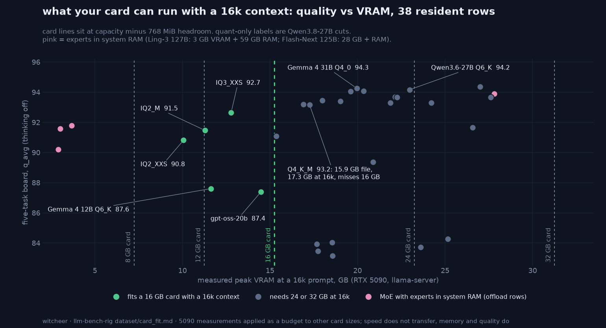

# What your card can run

Every row is a model + quant measured on the RTX 5090 board (think-off quality table). **VRAM @16k** is the peak sampled during the speed sweep, whose largest prompt is 16,384 tokens: weights, KV cache for a 16k prompt, compute buffers. The card columns apply that measured peak as a budget; they are not measurements on those cards, and decode speed on a smaller card scales with its memory bandwidth. Regenerate with `python scripts/card_fit.py results/`.

✅ runs resident with a 16k context on the board recipe (measured peak + 768 MiB headroom fits). 🟡 the file fits but the 16k peak does not: use a shorter context, quantise the KV cache (q8_0 roughly halves it), or take a smaller quant. ⬜ does not fit: the file is larger than the card. 🟠 runs with experts in system RAM: this row was measured under expert offload at the shown `--n-cpu-moe` (its VRAM column is that point, and it needs system RAM for the rest of the file, 59 GB on the measuring box); a card that cannot hold that point would need a larger `--n-cpu-moe`, not measured here (see the offload ladders in the Flash-Next and Ling-3 reports).

| Model | Quant | file GiB | VRAM @16k GiB | q_avg | GPQA | 8 GB | 12 GB | 16 GB | 24 GB | 32 GB |
|-------|-------|---------:|--------------:|------:|-----:|:----:|:-----:|:-----:|:-----:|:-----:|
| Gemma 4 31B-it | Q6_K | 23.5 | 27.0 | 94.4 |  | ⬜ | ⬜ | ⬜ | 🟡 | ✅ |
| Gemma 4 31B-it (unsloth cut) | Q4_0 | 16.4 | 20.0 | 94.3 | 58.6 | ⬜ | ⬜ | ⬜ | ✅ | ✅ |
| Qwen3.6-27B | Q6_K | 21.0 | 23.0 | 94.2 | 54.5 | ⬜ | ⬜ | ⬜ | ✅ | ✅ |
| Gemma 4 31B-it (Google QAT) | Q4_0 | 16.8 | 20.4 | 94.1 |  | ⬜ | ⬜ | ⬜ | ✅ | ✅ |
| Qwopus3.6-27B-Coder-MTP | Q5_K_M | 18.2 | 19.6 | 94.1 |  | ⬜ | ⬜ | ⬜ | ✅ | ✅ |
| Qwen3.8-Flash-Next 125B-A10B (`--n-cpu-moe 22`) | UD-Q2_K_XL | 73.5 | 27.8 | 93.9 | 54.0 | ⬜ | ⬜ | ⬜ | ⬜ | 🟠 |
| Qwopus3.6-27B-Coder-Compat-MTP | Q6_K | 20.9 | 22.1 | 93.7 |  | ⬜ | ⬜ | ⬜ | ✅ | ✅ |
| Qwable-5-27B-Coder | Q6_K | 20.9 | 22.1 | 93.7 |  | ⬜ | ⬜ | ⬜ | ✅ | ✅ |
| Qwen3.8-27B | Q6_K | 21.3 | 22.3 | 93.7 | 49.0 | ⬜ | ⬜ | ⬜ | ✅ | ✅ |
| Qwen3.8-27B | Q8_0 | 27.0 | 27.6 | 93.7 | 47.0 | ⬜ | ⬜ | ⬜ | ⬜ | ✅ |
| Qwen3.8-27B | UD-Q4_K_XL | 16.7 | 18.0 | 93.5 | 49.0 | ⬜ | ⬜ | ⬜ | ✅ | ✅ |
| Qwable-27B | Q4_K_M | 15.4 | 19.0 | 93.4 | 55.0 | ⬜ | ⬜ | 🟡 | ✅ | ✅ |
| Qwen3.6-27B-MTP-pi-tune | Q6_K | 20.9 | 24.2 | 93.3 |  | ⬜ | ⬜ | ⬜ | 🟡 | ✅ |
| Qwen3.6-35B-A3B | UD-Q4_K_M | 20.6 | 21.9 | 93.3 |  | ⬜ | ⬜ | ⬜ | ✅ | ✅ |
| Qwen3.6-27B-NVFP4-MTP (gguf) | NVFP4 | 14.6 | 16.9 | 93.2 |  | ⬜ | ⬜ | 🟡 | ✅ | ✅ |
| Qwen3.8-27B | Q4_K_M | 15.9 | 17.3 | 93.2 | 50.5 | ⬜ | ⬜ | 🟡 | ✅ | ✅ |
| Qwen3.8-27B | UD-IQ3_XXS | 11.1 | 12.8 | 92.7 | 45.0 | ⬜ | 🟡 | ✅ | ✅ | ✅ |
| Ling-3.0-flash 127B-A5B (`--n-cpu-moe all`) | Q3_K_M | 58.3 | 3.7 | 91.8 |  | 🟠 | 🟠 | 🟠 | 🟠 | 🟠 |
| Qwen3-Coder-Next | UD-Q2_K_XL | 24.9 | 26.6 | 91.7 |  | ⬜ | ⬜ | ⬜ | ⬜ | ✅ |
| Ling-3.0-flash 127B-A5B (`--n-cpu-moe all`) | IQ3_XXS | 47.7 | 3.0 | 91.6 |  | 🟠 | 🟠 | 🟠 | 🟠 | 🟠 |
| Qwen3.8-27B | UD-IQ2_M | 9.6 | 11.3 | 91.5 | 39.4 | ⬜ | 🟡 | ✅ | ✅ | ✅ |
| Qwen3.8-27B | UD-IQ2_XXS | 8.4 | 10.1 | 90.8 | 42.9 | ⬜ | ✅ | ✅ | ✅ | ✅ |
| Ling-3.0-flash 127B-A5B (`--n-cpu-moe all`) | IQ2_M | 39.2 | 2.9 | 90.2 |  | 🟠 | 🟠 | 🟠 | 🟠 | 🟠 |
| Ornith 1.5 35B-A3B | Q4_K_M | 20.2 | 20.9 | 89.4 | 52.0 | ⬜ | ⬜ | ⬜ | ✅ | ✅ |
| Gemma 4 12B-it | Q6_K | 9.1 | 11.6 | 87.6 |  | ⬜ | 🟡 | ✅ | ✅ | ✅ |
| gpt-oss-20b | Q4_K_M | 10.8 | 14.5 | 87.4 |  | ⬜ | 🟡 | ✅ | ✅ | ✅ |
| Nemotron 3.5 Lightning 30B-A3B | Q5_K_M | 25.1 | 25.2 | 84.3 | 38.9 | ⬜ | ⬜ | ⬜ | ⬜ | ✅ |
| Nemotron 3.5 Lightning 30B-A3B | IQ3_XXS | 18.4 | 18.5 | 84.0 | 39.9 | ⬜ | ⬜ | ⬜ | ✅ | ✅ |
| Nemotron 3.5 Lightning 30B-A3B | IQ2_M | 17.6 | 17.7 | 83.9 | 37.4 | ⬜ | ⬜ | ⬜ | ✅ | ✅ |
| Nemotron 3.5 Lightning 30B-A3B | Q4_K_M | 22.8 | 23.6 | 83.7 | 39.4 | ⬜ | ⬜ | ⬜ | 🟡 | ✅ |
| Nemotron 3.5 Lightning 30B-A3B | IQ4_XS | 17.6 | 17.7 | 83.5 | 37.9 | ⬜ | ⬜ | ⬜ | ✅ | ✅ |
| Nemotron 3.5 Lightning 30B-A3B | Q3_K_M | 18.4 | 18.6 | 83.2 | 38.9 | ⬜ | ⬜ | ⬜ | ✅ | ✅ |
| Nemotron 3.5 Lightning 30B-A3B | IQ2_XXS | 17.5 | 17.7 | 82.2 | 42.9 | ⬜ | ⬜ | ⬜ | ✅ | ✅ |
| Nemotron-3-Nano-30B-A3B | UD-Q4_K_XL | 21.3 | 23.3 | 82.2 |  | ⬜ | ⬜ | ⬜ | 🟡 | ✅ |
| Nemotron Cascade 2 30B-A3B | Q4_K_M | 23.0 | ? | 81.6 |  | ⬜ | ⬜ | ⬜ | ? | ? |
| Qwopus3.8-27B-Flash | Q6_K | 20.9 | ? | 79.7 | 51.0 | ⬜ | ⬜ | ⬜ | ? | ? |
| North-Mini-Code 1.0 | UD-Q6_K | 23.8 | 25.6 | 77.4 |  | ⬜ | ⬜ | ⬜ | 🟡 | ✅ |
