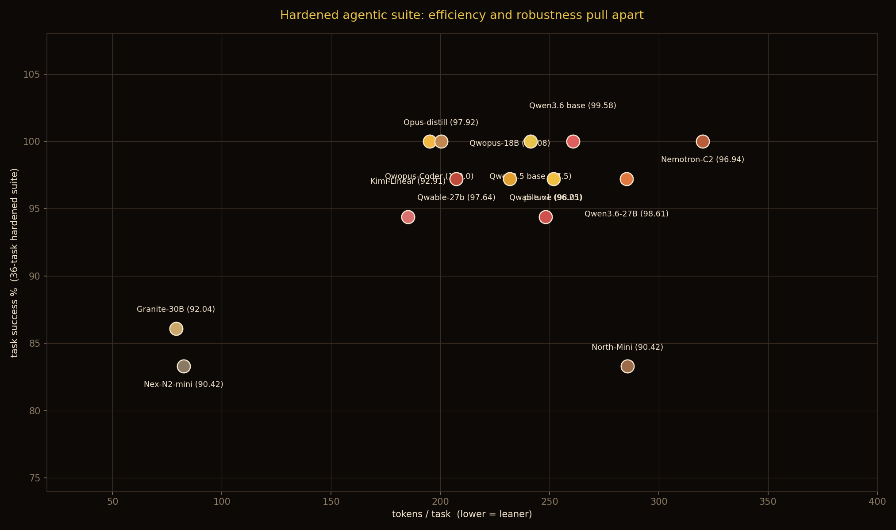
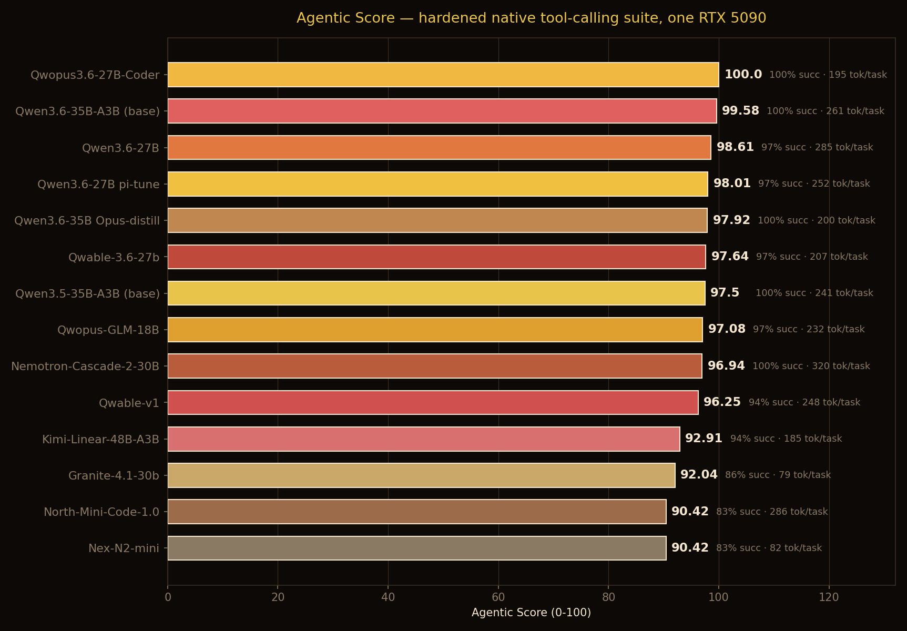
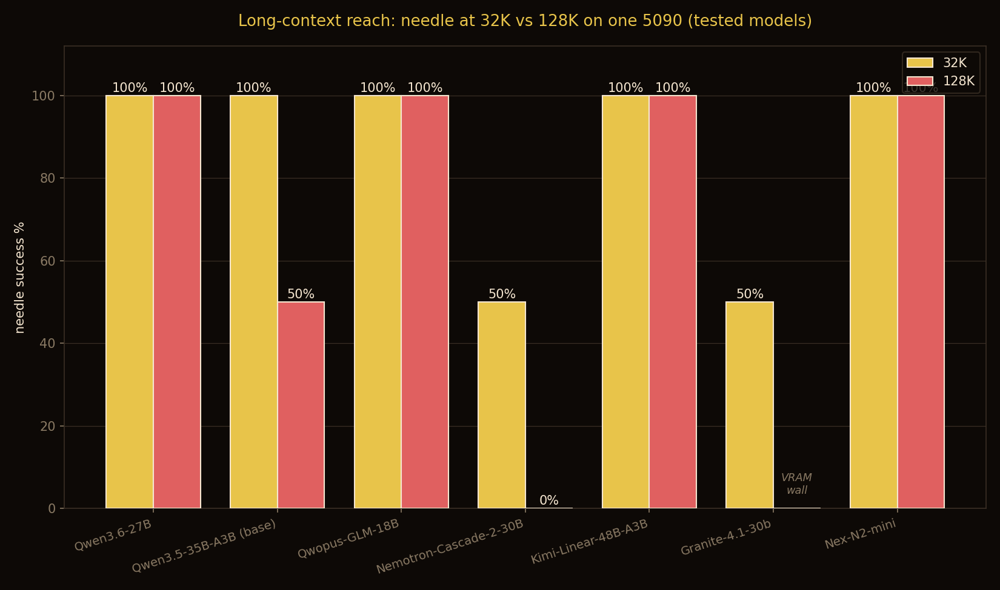

# 🛠️ Agentic Score Leaderboard — one RTX 5090

How well do local models actually **drive a tool-using agent loop**? Not single-call function-calling
benchmarks — a real loop: native OpenAI tool-calling through `llama-server`, multi-step deterministic
tasks, programmatic verification. Everything runs on a **single RTX 5090 32GB**.

Updated **2026-06-17** · llama.cpp b9562 · `--jinja` native tool-calling · temp 0.

## Leaderboard

| # | model | params | Agentic Score | success | tool-eff | tokens/task | chain | multistep | coding | lc@32k | lc@128k |
|---|---|---|---|---|---|---|---|---|---|---|---|
| 1 | **Qwopus3.6-27B-Coder** 🏆 | 27B | **100.0** | 100% | 1.00 | 195 | 8/8 | 8/8 | 8/8 | - | - |
| 2 | **Qwen3.6-35B-A3B (base)** | 35B-A3B | **99.58** | 100% | 0.98 | 261 | 8/8 | 8/8 | 8/8 | - | - |
| 3 | **Qwen3.6-27B** | 27B | **98.61** | 97% | 1.00 | 285 | 8/8 | 8/8 | 8/8 | 100% | 100% |
| 4 | **Qwen3.6-27B pi-tune** | 27B | **98.01** | 97% | 0.97 | 252 | 8/8 | 8/8 | 8/8 | - | - |
| 5 | **Qwen3.6-35B-A3B Opus-distill** | 35B-A3B | **97.92** | 100% | 0.90 | 200 | 8/8 | 8/8 | 8/8 | - | - |
| 6 | **Qwable-3.6-27b** | 27B | **97.64** | 97% | 0.95 | 207 | 8/8 | 8/8 | 8/8 | - | - |
| 7 | **Qwen3.5-35B-A3B (base)** | 35B-A3B | **97.5** | 100% | 0.88 | 241 | 8/8 | 8/8 | 8/8 | 100% | 50% |
| 8 | **Qwopus-GLM-18B** | 18B | **97.08** | 97% | 0.92 | 232 | 8/8 | 8/8 | 8/8 | 100% | 100% |
| 9 | **Nemotron-Cascade-2-30B** | 30B-A3B | **96.94** | 100% | 0.85 | 320 | 8/8 | 8/8 | 8/8 | 50% | 0% |
| 10 | **Qwable-v1** | 35B-A3B | **96.25** | 94% | 0.95 | 248 | 7/8 | 8/8 | 8/8 | - | - |
| 11 | **Kimi-Linear-48B-A3B** | 48B-A3B | **92.91** | 94% | 0.78 | 185 | 7/8 | 7/8 | 8/8 | 100% | 100% |
| 12 | **Granite-4.1-30b** | 30B | **92.04** | 86% | 0.95 | 79 | 8/8 | 8/8 | 7/8 | 50% | OOM |
| 13 | **Nex-N2-mini** | 35B-A3B | **90.42** | 83% | 0.94 | 82 | 7/8 | 7/8 | 7/8 | 100% | 100% |
| 14 | **North-Mini-Code-1.0** | 30B-A3B | **90.42** | 83% | 0.94 | 286 | 6/8 | 6/8 | 8/8 | - | - |

*tool-eff = tool calls vs optimal (1.0 = no wasted calls). tokens/task = avg completion tokens (lower =
leaner). A sub-5% score gap is a tie.*

## The Agentic Score (0–100)

Aggregate over 36 deterministic short-context tasks across five axes (tool-use chains, multi-step
dependencies, sandboxed coding, **error-recovery**, **distractor-robustness**), weighted as below.
A separate **long-context** axis (needle-in-a-document at 32K / 128K) is reported in the `lc@` columns,
not blended into the score (so a 128K VRAM wall doesn't corrupt it):

| axis | weight | measures |
|---|---|---|
| Task success | 0.50 | % tasks completed correctly (programmatic check) |
| Tool efficiency | 0.20 | tool calls vs optimal; malformed/wasted calls penalized |
| Token efficiency | 0.15 | avg tokens/task (efficiency at equal success) |
| Loop stability | 0.15 | completes without stalling / exceeding the step cap |

Calibration-grade (synthetic, deterministic, re-runnable) — and **reality-anchored**: across all 8 models on
30 real SWE-bench Verified bugs, the synthetic score predicts real-bug *rank* (Spearman ρ=0.76) and
moderately predicts resolve rate (Pearson r=0.59). Three known failure modes, all caught by the anchor:
it over-ranks models that drive tools fluently but don't commit fixes (Nemotron-Cascade-2: synthetic #5,
real last); it over-ranks models whose training data overlaps the bench's flavor (Qwopus3.6-27B-Coder:
trained on Hermes agent traces, posts a perfect 100 synthetic — then resolves fewer real bugs than its own
base model, 57% vs 63%); and it can **miss a regression entirely** when a distill stays in-distribution on
the synthetic tasks yet gives up on real bugs (Qwable-3.6-27b: agentic flat vs its base, yet real SWE-bench
resolve 11/30 vs 18/30 at matched Q4). Read the top of the board with the anchor open (see `reality-anchor/`).
Harness + unit tests: **[notwitcheer/llm-bench-rig](https://github.com/notwitcheer/llm-bench-rig)**
(`lib/agentic/native/`).

## Notes per model

- **Qwopus3.6-27B-Coder** (Jackrong/Qwopus3.6-27B-Coder-MTP-GGUF): coder SFT of Qwopus3.6-v2; trained on Hermes agent traces — partially in-distribution for this bench (see reality anchor)
- **Qwen3.6-35B-A3B (base)** (unsloth/Qwen3.6-35B-A3B-GGUF): vanilla generalist base — Qwable's untuned starting point; tops the board and ties best real SWE-bench resolve (19/30)
- **Qwen3.6-27B** (unsloth/Qwen3.6-27B-GGUF): dense 27B; the model Donald itself runs
- **Qwen3.6-27B pi-tune** (bytkim/Qwen3.6-27B-MTP-pi-tune-GGUF): dense Qwen3.6-27B QLoRA SFT on REAL non-thinking agent traces (terminal/tool/repo). Matched-Q6 vs its base: quality and agentic flat (98.01 vs 98.61), but real SWE-bench resolve IMPROVES 19 to 20/30 with FEWER give-ups (8 to 6), and its MTP drafter held (2.0-2.4x vs base 1.8-2.2x) where Qwopus-Coder's degraded. First of three Qwen3.6-27B coding tunes to improve real bug-fixing: provenance (real traces) beats synthetic distill, and only the anchor separates them (synthetic agentic a 2.4pt band, real SWE spans 11-20)
- **Qwen3.6-35B-A3B Opus-distill** (mradermacher/Qwen3.6-35B-A3B-Claude-4.7-Opus-Reasoning-Distilled-GGUF): base + Claude Opus-4.7 reasoning distill — the intermediate step before Qwable's Fable-5 agentic SFT
- **Qwable-3.6-27b** (Mia-AiLab/Qwable-3.6-27b): dense Qwen3.6-27B + Fable-5-style reasoning/instruction SFT. Matched-Q4 vs its base: quality AND agentic stay flat (97.64 vs 98.19), but real SWE-bench resolve drops 18→11/30 and give-ups rise 7→13 — a genuine bug-fixing regression the synthetic score MISSED (unlike the MoE Qwable-v1, whose agentic score declined). The anchor caught it; quant ruled out (base Q6→Q4 = −1 bug)
- **Qwen3.5-35B-A3B (base)** (bartowski/Qwen_Qwen3.5-35B-A3B-GGUF): generalist base, no agentic post-train
- **Qwopus-GLM-18B** (KyleHessling1/Qwopus-GLM-18B-Merged-GGUF): GLM-based community merge
- **Nemotron-Cascade-2-30B** (bartowski/nvidia_Nemotron-Cascade-2-30B-A3B-GGUF): Nvidia; the rig's prior speed-king
- **Qwable-v1** (lordx64/Qwable-v1-GGUF): base + Opus-4.7 reasoning distill + Fable-5 agentic SFT. Each step LOWERS the agentic score (99.58→97.92→96.25) and real resolve drops 19→11/30 vs the vanilla base — the distillation regressed agentic-coding capability (not a mirage: synthetic fairly predicts real here)
- **Kimi-Linear-48B-A3B** (bartowski/moonshotai_Kimi-Linear-48B-A3B-Instruct-GGUF): linear-attention; runs natively on one 5090; long-context untested here
- **Granite-4.1-30b** (unsloth/granite-4.1-30b-GGUF): leanest competent agent on the board
- **Nex-N2-mini** (eramax/Nex-N2-mini-gguf): agentic post-train of Qwen3.5; Adaptive Thinking
- **North-Mini-Code-1.0** (unsloth/North-Mini-Code-1.0-GGUF): Cohere agentic-coding MoE (cohere2moe), reasoning ON (its default); lands last despite the agentic-coding tuning — read vs its self-published SWE-bench Verified (reality anchor)

## How it grows

Each model: served Donald-safe on the 5090, hard-gated for parseable native `tool_calls`, then run
through the harness. New models are appended as they're benched. Companion write-ups live in the
[rtx-5090-benchmarks](https://huggingface.co/datasets/witcheer/rtx-5090-benchmarks) dataset.
