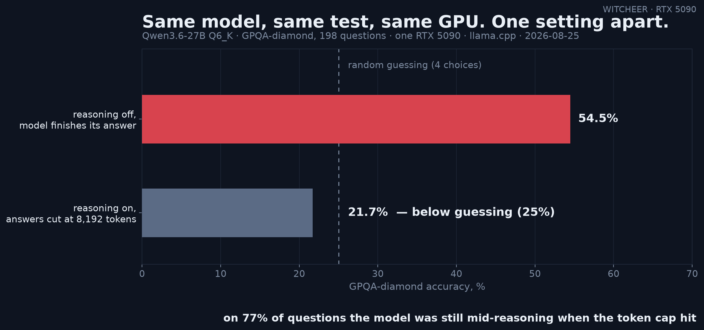

# The benchmark said below-chance. The model was fine: a truncation autopsy

**Date:** 2026-08-25 · **Hardware:** one RTX 5090 (32GB, sm_120) · **Server:** llama.cpp llama-server, OpenAI-compatible `/v1` · **Model:** Qwen3.6-27B Q6_K (MTP-embedded cut, drafter head inert under default serving)

## What this measures

How a fixed completion budget turns a reasoning model's benchmark score into a measurement of the cap rather than the model — pinned down with a same-file, same-server A/B.

An 18-hour full-profile run of [SM12X-LLM-BENCH](https://github.com/SM12X-SOCOM/SM12X-LLM-BENCH) (a community benchmark client for consumer Blackwell rigs) against this rig's resident llama-server completed clean: rc=0, zero infra errors across ~2,700 scored items. The systems lanes are solid. But its GPQA-diamond lane reported **21.7%** — below the 25% random-guessing floor for 4-choice questions — on a model whose family scores in the 50s on this rig. Below-chance accuracy on a competent model is a fire alarm: something in the pipeline is destroying answers, not measuring them.

## Method

- The harness runs quality lanes at `quality_max_tokens=8192` and served this model with its default thinking mode on. On GPQA its ttft p50 was 184s — the model is still inside its reasoning chain when the cap lands, so `finish_reason=length` arrives with no extractable answer, and the item scores as wrong. 153/198 items (77%) truncated this way. mmlu_pro showed the same shape at lower intensity (29% truncated, 62.0%).
- Anchor leg: reran GPQA-diamond through this rig's own harness (zero-shot, greedy, deterministic per-item option shuffle, seed `42-<idx>`) against the **same GGUF file on the same resident server**, with thinking off so answers fit the budget. 198 items, one pass.

## Results

| leg | thinking | completion budget | truncated | GPQA-diamond |
|---|---|---|---|---|
| harness full profile | on (model default) | 8,192 | 153/198 (77%) | 21.7% (43/198) |
| rig anchor, same file + server | off | fits | 0 parse failures | **54.5% (108/198)** |

Same weights, same quant, same server process, same GPU. One setting, 2.5x the score.

## Reads

1. **Below-chance accuracy is almost never the model.** A wrong-but-trying 27B lands near 25% on 4-choice; landing at 21.7% means answers are being destroyed post-generation (here: cut before they exist). Treat sub-chance scores as pipeline bugs until proven otherwise.
2. **Truncation rate is the diagnostic, and it was in the report all along.** The harness counts `truncated` per lane honestly — 153/198 sat right next to the 21.7% — but the lane still presents as PASS/publishable. Score fields get read; diagnostic fields get skipped. A guard (flag the lane when truncated/n passes a threshold) is the cheap fix, filed upstream as [#3](https://github.com/SM12X-SOCOM/SM12X-LLM-BENCH/issues/3) with two companion issues from the same run ([#1](https://github.com/SM12X-SOCOM/SM12X-LLM-BENCH/issues/1) long-context detection on llama-server, [#2](https://github.com/SM12X-SOCOM/SM12X-LLM-BENCH/issues/2) prompt-cache-inflated prefill throughput).
3. **Thinking-mode benchmarks need budgets sized to the thinking, not the answer.** This rig's own think-on GPQA legs budget 16,384 tokens and 2-4h per 27B rung for exactly this reason; 8,192 is an answer-sized budget applied to a deliberation-sized workload.

## Honest limits

- The anchor is think-off, so this is not "the model scores 54.5% think-on with a bigger cap" — it's the lower bound proving the 21.7% is artifact. A 16k think-on leg would complete the picture; not run here.
- One model, one quant, one benchmark lane. The mechanism (reasoning chains overrunning fixed caps) is general; the exact magnitudes are not.
- The harness itself behaved impeccably as a client: 18h, zero infra errors, incremental report writing. The finding is about score presentation, not plumbing — and its maintainer had the truncation counts in the output already, which is more than many harnesses ship.
