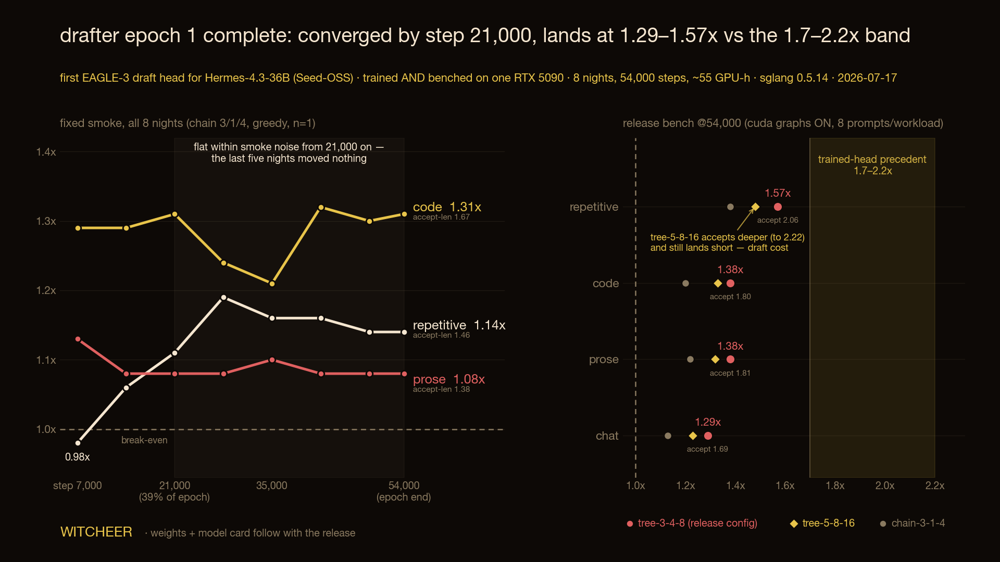

# First EAGLE-3 draft head for Hermes-4.3-36B, epoch 1: converged at 39% of the epoch, lands at 1.29–1.57x against a 1.7–2.2x precedent band

**Rig:** one RTX 5090 32GB · sglang 0.5.14 · teacher cyankiwi/Hermes-4.3-36B-AWQ-4bit (Seed-OSS) · greedy, batch 1
**Status:** epoch 1 complete (2026-07-17). Weights + model card follow with the release; this is the rig report.

## What this is

Hermes-4.3-36B (Seed-OSS architecture) had no speculative-decoding draft head on all of Hugging Face — the
architecture isn't wired for EAGLE-3 in any serving engine, and the standard SpecForge recipe assumes
multi-GPU offline training with terabytes of cached teacher activations. This run trained the first one,
**entirely on one consumer card**, using SpecForge's online mode (teacher resident in VRAM, activations
recomputed per batch — zero disk cost) with a 4-bit AWQ teacher.

Making it fit took six patches on top of SpecForge (branch: single-GPU online):

1. Optimizer CPU-offload — fp32 masters + AdamW moments (8.4 GiB) live in host RAM, step on CPU (~0.5 s,
   fully amortized under a ~3.7 s teacher-bound step)
2. Draft model built on CPU after the engine claims its VRAM floor
3. Skip FSDP at world_size 1 — FSDP silently allocates a 1.48 GiB gradient for the *frozen* embedding
4. Frozen embedding in host RAM (1.6 GiB; one lookup per batch)
5. Chunked acceptance-metric softmax (memory flat in sequence length)
6. Gradient checkpointing over the TTT unroll via flex_attention — unlocked 2048-token samples from night 2

Five of these are filed upstream (SpecForge [#669](https://github.com/sgl-project/SpecForge/pull/669),
[#670](https://github.com/sgl-project/SpecForge/pull/670), [#671](https://github.com/sgl-project/SpecForge/pull/671)),
plus the Seed-OSS serving port to sglang ([#30930](https://github.com/sgl-project/sglang/pull/30930)) and
EAGLE-3 hooks for vLLM ([#48403](https://github.com/vllm-project/vllm/pull/48403)).

**Training:** 54K curated conversations (34K Hermes-3 + 20K UltraChat, tool-calls excluded), one epoch =
54,000 steps across 8 unattended nights (~55 GPU-hours, every night rc=0). Night 1 at max-length 1024;
nights 2–8 at 2048 after the gradient-checkpointing patch. Pace ~3.7 s/step at both lengths — the step is
teacher-prefill-bound, so doubling the sample length was free.

## The release bench

Fixed prompt set (v1, 8 prompts per workload, never edited in place), 256-token completions, greedy,
cuda graphs ON, `mem_frac 0.85`, ctx 4096. Baseline is the same engine, same checkpoint, no speculative
decoding: 66.2–66.3 tok/s on every workload.

| config | prose | code | repetitive | chat |
|---|---|---|---|---|
| chain-3-1-4 | 1.22x (1.54) | 1.20x (1.52) | 1.38x (1.75) | 1.13x (1.42) |
| **tree-3-4-8** | **1.38x (1.81)** | **1.38x (1.80)** | **1.57x (2.06)** | **1.29x (1.69)** |
| tree-5-8-16 | 1.32x (1.96) | 1.33x (1.98) | 1.48x (2.22) | 1.23x (1.84) |

*(accept-len in parentheses)*

**tree-3-4-8 wins all four workloads and is the release config.** The config worth studying is
tree-5-8-16: it accepts *deeper* than 3-4-8 on every workload (up to 2.22 on repetitive) and still
delivers *less* speedup, because the wider tree's draft cost eats more than the extra accepted tokens
return. Acceptance is not speedup: every drafted token costs teacher-side compute whether it lands or not.

## Finding 1: the head converged at 39% of the epoch

The release bench was dry-run at step 21,000, where tree-3-4-8 already won every workload at
**1.30–1.53x**. At epoch end, 33,000 steps later, the same config lands at **1.29–1.57x** — the final
checkpoint reproduces the 39%-of-epoch checkpoint within noise.

The nightly fixed smoke (chain 3/1/4, n=1 — a trend instrument, not a release number) says the same thing
with eight points: accept-lens froze at night 3 (code 1.67, repetitive 1.46, prose 1.38) and every
subsequent point stayed within smoke noise. **The last five nights, 60% of the epoch, moved nothing.**
The data is saturated for this head.

## Finding 2: the precedent band stays out of reach, and the mechanism is visible

Trained-head precedent for EAGLE-3 heads is 1.7–2.2x. This head lands at 1.29–1.57x. The gap is not
undertraining (finding 1 rules that out on this data). The arithmetic: at accept-len 1.80, a free drafter
would deliver ~1.8x; the measured 1.38x means roughly a quarter of the theoretical gain goes to running
the draft head itself, at batch 1 on one card where the verify pass has no batching to amortise against.
Deeper trees make this worse, not better (the tree-5-8-16 row above). The levers that could close the gap are a
cheaper draft pass or training data that pushes acceptance past ~2.5 — not more epochs of this data.

## Decision

No epoch 2 on the same data — the curve is flat and re-training on saturated data spends GPU-nights on
nothing. The head releases as-is with honest numbers: **1.3–1.6x real decode speedup on a single RTX 5090,
tree-3-4-8, batch 1.** A v2, if it happens, changes the data mix, not the step count.

## Honest caveats

- 8 prompts per workload, greedy, 256-token completions, single run — the fixed set makes points
  comparable across the run, not statistically tight. Curve *shape* (8 nightly points) is the evidence;
  any single cell has smoke-level noise.
- On the repetitive workload, 6 of 8 baseline completions terminate naturally before 256 tokens — the
  workload's tok/s rests on fewer decoded tokens than the others.
- One teacher quant (AWQ 4-bit), one engine (sglang 0.5.14), batch 1 only. Server-style batched serving
  changes speculative-decoding economics entirely; these numbers are the local-single-user story.
- The 1.7–2.2x band is precedent from published trained heads (different teachers, data recipes, and
  hardware) — it's the reference the run was read against, not a controlled comparison.

## Artifacts

- Draft head weights + model card: with the release
- Training patches: SpecForge [#669](https://github.com/sgl-project/SpecForge/pull/669) ·
  [#670](https://github.com/sgl-project/SpecForge/pull/670) ·
  [#671](https://github.com/sgl-project/SpecForge/pull/671)
- Serving: sglang Seed-OSS port [#30930](https://github.com/sgl-project/sglang/pull/30930) ·
  vLLM EAGLE-3 hooks [#48403](https://github.com/vllm-project/vllm/pull/48403)
- Single-GPU drafter-training failure modes: [sm120-field-guide](https://github.com/notwitcheer/sm120-field-guide),
  `guide/drafter-training.md`
