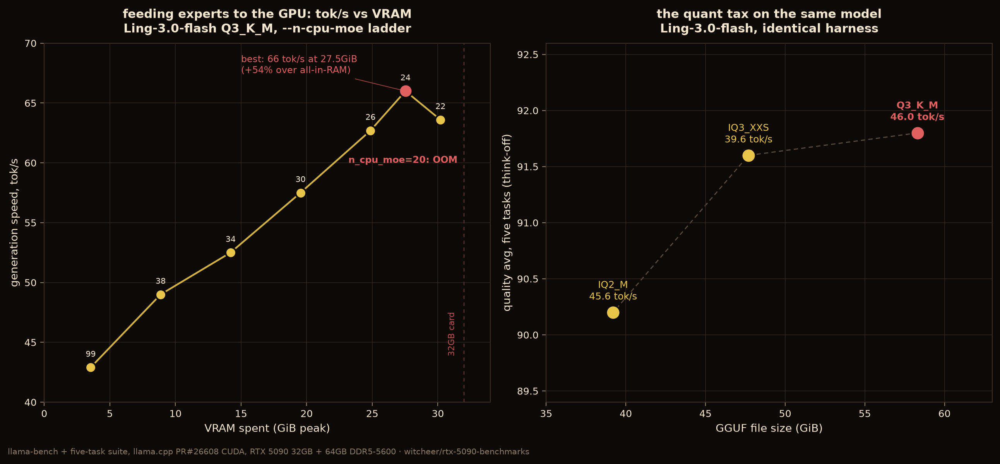

# Ling-3.0-flash Q3_K_M: the `--n-cpu-moe` offload curve (RTX 5090)

**Date:** 2026-08-09
**Author:** WITCHEER
**Platform:** NVIDIA GeForce RTX 5090 Benchmark Rig (capsule)

---

## What this measures

For MoE models too large for VRAM, llama.cpp's `--n-cpu-moe N` keeps the routed experts of the first N layers in system RAM and puts the rest on the GPU. The usual advice is "fill the card". This sweep measures what that actually buys on a 32GB RTX 5090 with Ling-3.0-flash Q3_K_M (58.3 GiB file, 127.5B total / 5.1B active, 512 routed experts), llama.cpp PR [#26608](https://github.com/ggml-org/llama.cpp/pull/26608) branch (head 0266ebca6), CUDA.

Method: `llama-bench -ngl 99 --n-cpu-moe N -p 2048 -n 128 -r 3` per point, VRAM peak sampled at 1Hz via `nvidia-smi` during each run. Note the generation numbers are conditioned on a 2048-token prompt in context; bare tg128 on this model reads ~3 tok/s higher (46.0 in the [Q3_K_M report](ling-3-0-flash-q3-k-m.md)).

## Results

| `--n-cpu-moe` | gen tok/s | VRAM peak | note |
|---:|---:|---:|---|
| 99 (all experts in RAM) | 42.9 | 3.6 GiB | baseline |
| 38 | 49.0 | 8.9 GiB | |
| 34 | 52.5 | 14.2 GiB | |
| 30 | 57.5 | 19.5 GiB | |
| 26 | 62.7 | 24.9 GiB | |
| **24** | **66.0** | **27.5 GiB** | **optimum, +54% over baseline** |
| 22 | 63.6 | 30.2 GiB | inversion: more VRAM, less speed |
| 20 | — | OOM | allocation fails |

## Reads

1. **Expert placement scales throughput almost linearly until the card is nearly full.** Every ~5.5 GiB of experts moved to VRAM buys roughly 4-5 tok/s.
2. **The optimum is not at the VRAM ceiling.** Peak throughput lands at 27.5 GiB on a 32GB card; pushing to 30.2 GiB *costs* 2.4 tok/s, and one step further fails to allocate. Leave ~4 GiB of headroom.
3. The inversion at n_cpu_moe=22 is consistent with allocation pressure near the ceiling (fragmentation and reduced scratch/compute buffer room), not with any property of the model.

Raw JSON (per-point `llama-bench` output and VRAM samples) ships with the dataset. Companion quant-ladder reports: [IQ3_XXS](ling-3-0-flash-iq3-xxs.md), [IQ2_M](ling-3-0-flash-iq2-m.md).

