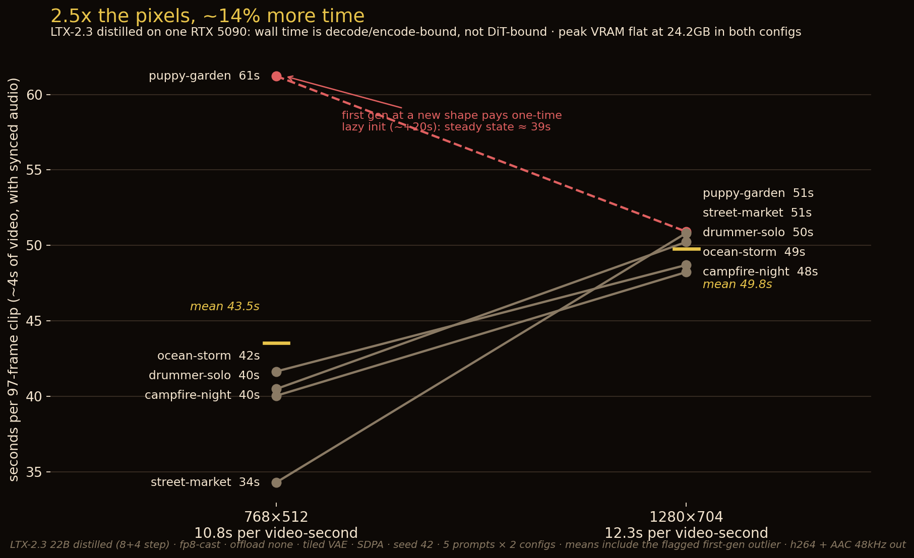

# LTX-2.3: synchronized audio-video generation on one RTX 5090

**TL;DR:** LTX-2.3's distilled two-stage pipeline generates a 97-frame (~4 s) clip **with synchronized audio** in ~40 s at 768×512 and ~50 s at 1280×704 on a single RTX 5090 — 10.8 and 12.3 seconds of compute per second of output video. Peak VRAM is flat at **24.2 GB in both configs** (no wall at 720p-class), because wall time is dominated by VAE decode + mp4/AAC encode, not the DiT: 2.5× the pixels costs only ~14% more time. First consumer-Blackwell (sm_120) numbers we're aware of.



## Setup

| | |
|---|---|
| model | Lightricks LTX-2.3 22B distilled 1.1 (~19B = 14B video + 5B audio dual-stream DiT; "22B" is marketing) + spatial upscaler x2 |
| pipeline | vendor `DistilledPipeline` (two-stage: 8 steps at half resolution, then a 2× upsample + 3 refine steps as measured; vendor materials describe it as 8+4) |
| config | `fp8-cast` (bf16 checkpoint downcast on the fly — the consumer path; fp8-scaled-mm is Hopper-only) · offload none · default tiled VAE · SDPA (no flash-attn) |
| text encoder | Gemma-3-12B-it QAT q4_0 unquantized (gated) |
| hardware | RTX 5090 32GB (sm_120), torch 2.10+cu128, native github.com/Lightricks/LTX-2 repo, `uv sync --frozen` |
| matrix | 5 prompts × {768×512, 1280×704} × 97 frames @ 24 fps, seed 42, warm-up discarded |
| adapter | `scripts/ltx_synth.py` — pipeline constructed once, prompts looped, `gen_seconds` spans pipeline call **through** `encode_video` (the video decoder returns a lazy chunk iterator, so VAE decode happens inside the encode) |

## Results

| config | mean s/clip | s per video-second | true peak VRAM | failures |
|---|---|---|---|---|
| 768×512 × 97f | 43.5 (steady ≈ 39) | 10.8 | 24.2 GB | 0/5 |
| 1280×704 × 97f | 49.8 | 12.3 | 24.2 GB | 0/5 |

Per-clip VRAM is `torch.cuda.max_memory_allocated()` after a per-gen reset (caching-allocator-immune); nvidia-smi global peaked ~25.3 GB. Full per-record data in `assets/ltx/bench/synth.json`; all ten mp4s (h264 + AAC 48 kHz stereo, audio synced in one pass) in `assets/ltx/bench/`.

## The mechanism: resolution is nearly free because the DiT is not the bottleneck

From the pipeline's own step rates, diffusion accounts for ~5 s of a 768×512 clip (8 steps @ 3.46 it/s + 3 refine steps @ ~1.06 it/s) and ~12 s of a 1280×704 clip (1.58 it/s / 2.35 s/it). The remaining ~35 s at either resolution is tiled VAE video decode, audio decode, and h264/AAC encode. Consequences:

- **Render at 1280×704.** The quality jump costs ~6 s per clip.
- Speed-up work on the DiT (fewer steps, faster kernels) can only touch ~12–28% of wall time at these clip lengths. The lever that matters on consumer hardware is the decode/encode path.

## Honest limits

- **The first generation at a new shape pays ~+20 s of one-time lazy init** (our warm-up ran at a smaller shape; the first 768×512 clip measured 61 s vs a 34–42 s steady state). It is kept in the published mean and flagged — warm up at your production shape to avoid it.
- Pipeline construction is lazy (0.01 s); model load lands in the first generation. A cold one-clip run (our gate smoke) was 50 s wall including all loads.
- Lightricks claims LTX-2 is ~5.7× faster than Wan2.2 on a 5090. We did not run Wan2.2 (out of scope for this session's budget) — our numbers are LTX-2.3 absolutes, not a comparison.
- Quality is judged by the attached clips, not a score: motion, lighting and audio sync are convincing at both resolutions on these five prompts; no green/grayscale corruption (the documented pre-2.3 Blackwell footgun did not appear).
- License: LTX-2 Community License (free below $10M revenue) — check it before commercial use.

## Reproduce

```bash
# clone github.com/Lightricks/LTX-2, uv sync --frozen, download the distilled
# checkpoint + spatial upscaler + the gated Gemma-3-12B QAT text encoder, then:
python scripts/ltx_synth.py \
  --distilled-checkpoint <ckpt>/ltx-2.3-22b-distilled-1.1.safetensors \
  --gemma-root <gemma-dir> --upsampler <ckpt>/ltx-2.3-spatial-upscaler-x2-1.1.safetensors \
  --prompts dataset/ltx/prompts.json --configs 768x512x97,1280x704x97 \
  --fps 24 --seed 42 --warmup 512x320x33 --out-dir out --synth-json out/synth.json
python scripts/ltx_bench.py --synth-json out/synth.json --out out/summary.json
```

Two-stage constraints (enforced in `lib/ltx/config.py`, tested): H and W divisible by 64, frame count of the form 8k+1.

*Part of the [rtx-5090-benchmarks](https://huggingface.co/datasets/witcheer/rtx-5090-benchmarks) field reports — everything local, one card, measured honestly.*
