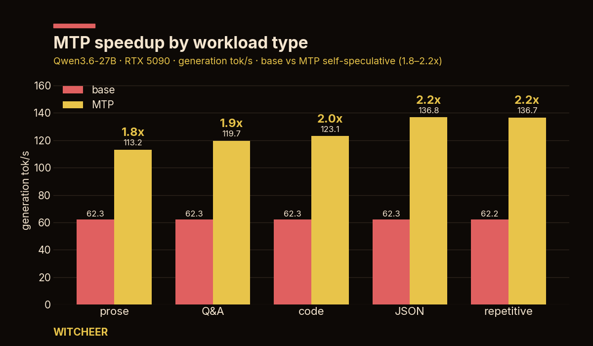

# MTP self-speculative decoding on Qwen3.6-27B (RTX 5090)

**Claim:** switching Qwen3.6-27B to the MTP variant and enabling self-speculative decoding gives
**~1.8–2.0× faster generation (≈62 → 115–126 tok/s), lossless**, on a single RTX 5090 at 64K context.
The exact figure is **workload-dependent** (it scales with how many self-drafted tokens get accepted).

This page is the reproduction record: exact environment, exact commands, the method, and the script that
produced the numbers below — run it on your own 5090 to re-measure.

---

## Environment

| | |
|---|---|
| GPU | NVIDIA RTX 5090, 32 GB |
| engine | llama.cpp, build **9365** (`ba4dd0bc6`) — first build with `--spec-type draft-mtp` |
| model (baseline) | `unsloth/Qwen3.6-27B-GGUF` → `Qwen3.6-27B-Q6_K.gguf` (21 GB) |
| model (MTP) | `unsloth/Qwen3.6-27B-MTP-GGUF` → `Qwen3.6-27B-Q6_K.gguf` (**22.9 GB**, +~2 GB for the MTP heads) |
| context | 65536 (64K) |
| measured | 2026-06-01 (original ad-hoc sample) + **2026-06-02 reproduction** via `scripts/bench_mtp.sh` |

## Commands

**Baseline:**
```
llama-server --model Qwen3.6-27B-Q6_K.gguf --n-gpu-layers 99 --ctx-size 65536 --flash-attn on --parallel 1
```

**MTP self-speculative (the only deltas):**
```
llama-server --model Qwen3.6-27B-MTP-Q6_K.gguf --n-gpu-layers 99 --ctx-size 65536 --flash-attn on --parallel 1 \
             --spec-type draft-mtp --spec-draft-n-max 2 \
             --cache-type-k q8_0 --cache-type-v q8_0
```
- `--spec-type draft-mtp --spec-draft-n-max 2` — the model drafts up to 2 tokens with its MTP heads and verifies them in the full pass. No separate draft model.
- `--cache-type-k q8_0 --cache-type-v q8_0` — quantise the KV cache to q8 to reclaim the ~2 GB the MTP heads cost, so 64K still fits.

## Results

| run | prompt / method | gen tok/s | speedup | VRAM |
|---|---|---|---|---|
| original sample (2026-06-01) | ad-hoc 256-tok sample | 62 → 115 | 1.84× | ~26 GB |
| **repro script (2026-06-02)** | code+prose, `n_predict=256`, mean of 3 | **62.3 → 125.8** | **2.02×** | 25940 → 25808 MiB (~25.3 → 25.2 GiB) |

**Net: ~1.8–2.0× faster, lossless.** Baseline reproduced to within 0.5% of the original (62.3 vs 62),
which validates the method; the MTP figure varies with workload (see caveats). Both configs sit ~25 GiB
of 32 GB — the q8 KV savings roughly cancel the +2 GB MTP weights.

Output is bit-for-bit identical to baseline at greedy decode — the full model verifies every token, so
acceptance affects only *speed*, never *content*. (q8 KV cache is near-lossless; see caveats.)

**Draft acceptance:** ~69% was observed during the original tuning run. The reproduction script did **not**
re-capture it — llama-server didn't emit spec stats to the log in a form the script could parse (a known
gap; wiring up acceptance capture is a TODO).

## Speedup by workload

The 1.8–2.0× band is **workload-dependent**: MTP's gain scales with how predictable the output is.
Base vs MTP generation tok/s at a small fixed context (one run each, `n_predict=256`, `temperature=0`):



| workload | base tok/s | MTP tok/s | speedup |
|---|---|---|---|
| free prose | 62.3 | 113.2 | 1.8× |
| Q&A / explanation | 62.3 | 119.7 | 1.9× |
| code | 62.3 | 123.1 | 2.0× |
| JSON / structured | 62.3 | 136.8 | 2.2× |
| repetitive | 62.2 | 136.7 | 2.2× |

Base decode is flat (~62 t/s, content-independent); MTP rises with predictability — 1.8× on free prose
up to 2.2× on structured/repeated output. MTP helps across the board here, more the more guessable the
next tokens are. Reproduce: `scripts/bench_mtp_workload.sh`.

**Two methodology gotchas (each cost a few bad runs):**
- **`ignore_eos: true` suppresses speculative decoding in this build** — it pins MTP to baseline speed.
  Don't force generation length that way; use prompts that naturally generate enough tokens.
- **Don't race the port.** The live server holds the GPU + port; a naive `stop; sleep; relaunch` can let an
  orphaned server keep the port, so you silently measure the *wrong* process (base and MTP then read
  identical). Gate on the port being free AND VRAM drained before launching, and verify your own PID
  bound — `bench_mtp_workload.sh` does this.

## Method (and why not `llama-bench`)

The rig's standard speed path (`bench.py --speed-only` → `llama-bench`) **cannot** measure this. `llama-bench`
runs raw decode with no speculator, so it reports the base model's throughput regardless of MTP. The MTP
gain is a serving-time, workload-dependent effect: it comes entirely from how many self-drafted tokens get
accepted during real generation. So the measurement is taken from a live `llama-server`:

- fixed prompt, `n_predict=256`, `temperature=0` (deterministic), `cache_prompt=false`.
- one warmup request discarded; then the mean of 3 timed runs, reading `timings.predicted_per_second`
  straight from the server's own response.
- VRAM from `nvidia-smi`.

## Reproduce it

```
# on the capsule, with both model files present:
bash scripts/bench_mtp.sh
```
The script stops the live `llama-server.service`, measures baseline then MTP on the same prompt, prints the
before/after table, and **always restarts the service on exit** (so the agent comes back online even if the
run is interrupted). Override defaults with env vars (`PORT`, `NPREDICT`, `REPS`, `BASE_MODEL`, `MTP_MODEL`,
`SERVICE`, `LLAMA_SERVER`). Note: `SERVICE` must match your NOPASSWD sudoers entry exactly.

## Caveats (honest)

- **Speedup is workload-dependent — hence the range.** Predictable text (code, structured output) accepts
  more self-drafted tokens and gains more; high-entropy or sampled generation accepts fewer and gains less.
  The two measured points (1.84× and 2.02×) are the same mechanism on different prompts.
- **Single prompt, n=3 per config.** A fuller figure would average several prompt classes; treat ~1.8–2.0×
  as the honest band, not a precise constant.
- **MTP requires `--parallel 1`** — no multi-slot batching. Great for a single-user agent; not for serving
  many concurrent requests.
- **q8 KV cache is near-lossless, not bit-identical.** No measurable quality difference observed at q8; for
  zero compromise on the cache, lower the context instead of quantising it.
