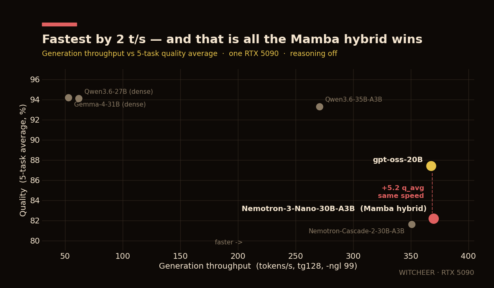

# Benchmark Report: Nemotron-3-Nano-30B-A3B (UD-Q4_K_XL)

**Date:** 2026-06-04  
**Author:** WITCHEER  
**Platform:** NVIDIA GeForce RTX 5090 Benchmark Rig (capsule)  

---

## Model

| Field | Value |
|-------|-------|
| Model | Nemotron-3-Nano-30B-A3B |
| Parameters | 31.58 B (moe (3b active)) |
| Architecture | Hybrid Mamba-2 + MoE |
| Quantization | UD-Q4_K_XL |
| File size | 21.27 GiB |
| Engine | llama.cpp (CUDA 12.8 (patched)) |

## Hardware

| Component | Spec |
|-----------|------|
| GPU | NVIDIA GeForce RTX 5090 |
| CPU | AMD Ryzen 5 9600 |
| RAM | 64GB DDR5-5600 |
| OS | Ubuntu 26.04 LTS |
| CUDA | 12.8 (patched) |

---

## Quality Benchmarks

All benchmarks use generative evaluation via llama-server chat completions. Multiple-choice tasks (MMLU, ARC, HellaSwag) use letter extraction instead of loglikelihood scoring -- results are internally consistent for model comparison but absolute scores may differ from logprob-based evaluations by 5-15%.

### Summary

| Benchmark | Score | Metric |
|-----------|------:|--------|
| **MMLU** | **74.52%** | accuracy |
| **ARC-Challenge** | **89.93%** | accuracy |
| **HellaSwag** | **75.62%** | accuracy |
| **HumanEval** | **80.49%** | pass@1 |
| **GSM8K** | **90.52%** | exact_match |

### MMLU Breakdown by Category

| Category | Score | Correct / Total |
|----------|------:|----------------:|
| Stem | 70.01% | 1,055 / 1,507 |
| Humanities | 74.65% | 1,181 / 1,582 |
| Social Sciences | 84.82% | 1,402 / 1,653 |
| Other | 69.93% | 1,586 / 2,268 |

*Sampled at 50% (seed 42)*

---

## Speed Benchmarks

Measured with `llama-bench`. All layers GPU-offloaded (`-ngl 99`).

### Prompt Processing (tokens/s)

| Context Length | Speed | +/-sigma |
|---------------:|------:|---------:|
| 128 | 4,377 | 56.9 |
| 512 | 10,645 | 51.3 |
| 2048 | 10,235 | 58.1 |
| 4096 | 9,936 | 28.7 |
| 8192 | 9,408 | 25.6 |
| 16384 | 8,498 | 24.9 |

### Generation (tokens/s)

| Metric | Speed | +/-sigma |
|--------|------:|---------:|
| tg128 | 369.6 | 1.6 |

Peak VRAM: 23.3 GB (loads fully in 32 GB at `-ngl 99`, no offload).

---

## Findings

- **First Mamba-hybrid model on this rig.** Nemotron-3-Nano-30B-A3B pairs Mamba-2 sequence layers with a sparse MoE (3 B active of 31.6 B). Every other model on the board is a pure transformer.
- **Highest generation throughput measured here: 369.6 t/s.** It edges the previous fastest models, gpt-oss-20B (367.4 t/s) and Nemotron-Cascade-2-30B-A3B (350.8 t/s). The linear-attention component is doing real work on the decode path.
- **Speed without a quality edge.** At the same ~368 t/s tier, gpt-oss-20B scores +5 on the 5-task average (87.4 vs 82.2) and +14 on HumanEval (94.5 vs 80.5). On one RTX 5090, reasoning off, the Mamba hybrid's throughput does not translate into a quality-per-token advantage over the transformer MoEs.
- **Solid standalone reasoning, weaker knowledge.** GSM8K 90.5% and ARC-Challenge 89.9% are strong for a 3 B-active model at Q4. The gap to the field is in knowledge recall (MMLU 74.5) and code (HumanEval 80.5).

### Note on HumanEval scoring

HumanEval was re-scored after fixing a code-extraction bug in this rig's harness. Nemotron-3-Nano emits function bodies in an absolute-indentation format: the first statement at column 0, but every subsequent line already at its true 4-space-based indentation. The harness assumed a fully-relative body and added a uniform 4-space indent to every line, over-indenting lines 2+ and failing **119 of 164** tasks with `IndentationError` -- understating the score as **20.73%**.

The assembler now generates candidate assemblies (full-function, verbatim, relative, absolute-first-line-dropped) and returns the first that `compile()`s, yielding the corrected **80.49% (132/164)**. The remaining 32 failures are genuine model errors (typos, missing imports, wrong logic), not harness artifacts. Fix and regression test: `lib/evals/humaneval.py`, `tests/test_humaneval_extract.py`.

---

## Methodology

### Evaluation Framework

Custom generative evaluators built for this rig. All benchmarks run through llama-server's `/v1/chat/completions` endpoint.

- **Scoring:** Generative evaluation (not loglikelihood)
- **Thinking:** disabled
- **MCQ scoring:** First valid letter extracted from response (A/B/C/D)
- **Sampling:** 50% of dataset used
- **Temperature:** 0 (deterministic)
- **Max tokens:** 2,048 (4,096 for HumanEval)
- **GPU offload:** All layers (`-ngl 99`)

---

*Benchmarked by WITCHEER on the RTX 5090 Benchmark Rig. Source: [github.com/notwitcheer/llm-bench-rig/blob/main/reports/nemotron-3-nano-30b-a3b-ud-q4-k-xl.md](https://github.com/notwitcheer/llm-bench-rig/blob/main/reports/nemotron-3-nano-30b-a3b-ud-q4-k-xl.md). Dataset: [huggingface.co/datasets/witcheer/rtx-5090-benchmarks/blob/main/reports/nemotron-3-nano-30b-a3b-ud-q4-k-xl.md](https://huggingface.co/datasets/witcheer/rtx-5090-benchmarks/blob/main/reports/nemotron-3-nano-30b-a3b-ud-q4-k-xl.md).*
