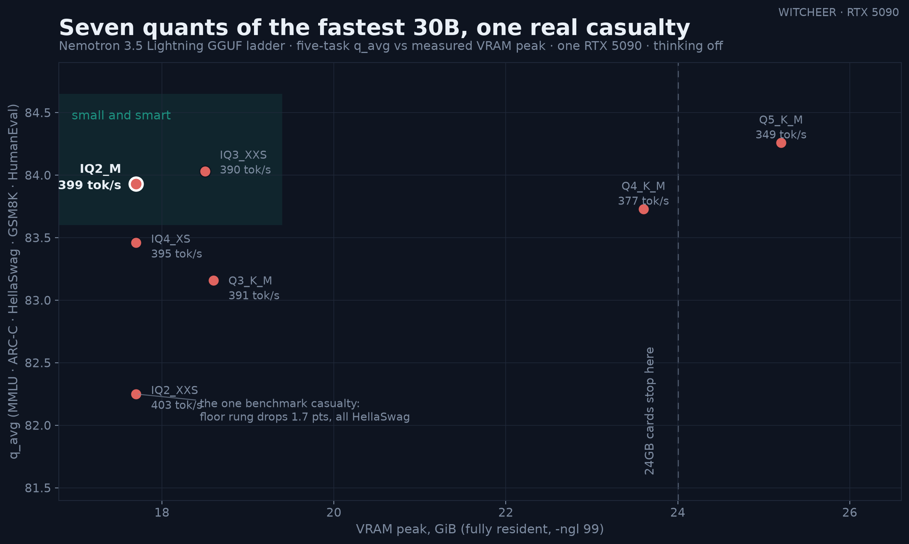

# NVIDIA-Nemotron-3.5-Lightning-30B-A3B: the seven-rung quant-tax ladder (RTX 5090)

**Date:** 2026-08-13
**Author:** WITCHEER
**Platform:** NVIDIA GeForce RTX 5090 Benchmark Rig (capsule)

---

## What this measures

Nemotron 3.5 Lightning is the fastest 30B-class model on this board (350-400 tok/s single-stream on one RTX 5090, MoE, ~3B active). The day-0 report banked one GGUF point (Q4_K_M) and the official NVFP4 build. This ladder answers the question that follows: **which GGUF quant should you actually download?** Seven rungs from [bartowski's imatrix repo](https://huggingface.co/bartowski/NVIDIA-Nemotron-3.5-Lightning-30B-A3B-GGUF), IQ2_XXS through Q5_K_M, each through the full five-task quality board plus the llama-bench speed sweep, same harness every rung.

Method: llama.cpp build b10338-33-g5d16e81dd (worktree carrying the day-0 Nemotron merge plus the MTP-export fix, PR [#26903](https://github.com/ggml-org/llama.cpp/pull/26903)), all layers GPU-resident (`-ngl 99`), thinking off, temperature 0. MMLU and HellaSwag sampled 50% (seed 42); ARC-Challenge, GSM8K, HumanEval full. VRAM peak read from `nvidia-smi` during each run. The ladder ran in two batches (IQ2_XXS + IQ4_XS on 2026-08-12, the remaining four on the morning of 2026-08-13, after a scheduling bug on our side skipped them in the first pass); identical build, config and harness in both batches.

One file-format note: the ladder GGUFs embed Lightning's MTP drafter head (llama-bench reads 32.91B params vs 31.58B for the day-0 Q4_K_M, cut before the MTP export fix). The head is inert in these runs — no speculative decoding — but it is part of each file's size on disk.

## Results

| Rung | File (GiB) | VRAM peak (GiB) | MMLU | ARC-C | HellaSwag | GSM8K | HumanEval | q_avg | tg128 (tok/s) |
|---|---:|---:|---:|---:|---:|---:|---:|---:|---:|
| IQ2_XXS | 17.54 | 17.7 | 76.8 | 92.2 | 75.7 | 84.9 | 81.7 | **82.3** | 402.9 |
| IQ2_M | 17.55 | 17.7 | 77.2 | 92.1 | 80.3 | 87.3 | 82.9 | **83.9** | 399.3 |
| IQ3_XXS | 18.43 | 18.5 | 78.0 | 92.4 | 81.1 | 86.4 | 82.3 | **84.0** | 390.1 |
| Q3_K_M | 18.45 | 18.6 | 77.1 | 91.7 | 81.3 | 86.4 | 79.3 | **83.2** | 390.8 |
| IQ4_XS | 17.61 | 17.7 | 77.9 | 92.6 | 82.2 | 84.7 | 79.9 | **83.5** | 394.5 |
| Q4_K_M† | 22.82 | 23.6 | 77.9 | 92.2 | 80.6 | 85.6 | 82.3 | **83.7** | 377.4 |
| Q5_K_M | 25.10 | 25.2 | 78.0 | 92.7 | 82.1 | 86.9 | 81.7 | **84.3** | 348.7 |

† Q4_K_M is the day-0 point ([report](nvidia-nemotron-3-5-lightning-30b-a3b-q4-k-m.md)), re-listed for the curve; it predates the MTP-embedding re-cut, hence the different file layout.

Full prompt-processing sweeps (pp128-pp16384) for every rung ship in [`dataset/benchmarks.csv`](../dataset/benchmarks.csv).

## Reads

1. **The quant tax on this model is nearly zero above the floor.** Six of the seven rungs land inside 1.1 q_avg points of each other (83.2-84.3). From Q5_K_M down to IQ2_M you give up 0.3 points and gain 50 tok/s and 7.5 GiB of VRAM.
2. **Only the floor rung pays, and it pays in one benchmark.** IQ2_XXS drops to 82.3, and the entire gap is HellaSwag (75.7 vs 80.3-82.2 everywhere else); the other four suites barely move. Same pattern the Ling-3.0-flash ladder showed — quant damage concentrates in one suite rather than spreading evenly.
3. **IQ2_M is the rung to download.** It is 16 MB larger than IQ2_XXS yet 1.7 q_avg points better — and it beats not just the floor: it is smaller, higher-scoring and faster than both Q3_K_M and IQ4_XS (which it strictly dominates on all three axes). At 17.6 GiB VRAM peak it is the quality-per-gigabyte optimum of the ladder. Honest caveat: single runs, and 0.3-0.5 q_avg gaps are within run-to-run noise; the 1.7-point floor gap is not.
4. **Repo curiosity: IQ4_XS ships smaller than IQ3_XXS** (17.61 vs 18.43 GiB) in this repo, and Q3_K_M is strictly dominated. Rung names are not a size or quality ordering — measure, don't assume.
5. **Card fit:** everything through Q4_K_M runs fully resident on a 24GB card (Q4_K_M peaks at 23.6 GiB — tight but real); Q5_K_M needs 25.2 GiB, so 32GB territory or expert offload. No rung fits 16GB resident.

Companions: [day-0 Q4_K_M + official NVFP4](nvidia-nemotron-3-5-lightning-30b-a3b-q4-k-m.md) · [Ling-3.0-flash quant ladder + offload sweep](ling-3-offload-sweep.md).

---

*Benchmarked by WITCHEER on the RTX 5090 Benchmark Rig. Source: [github.com/notwitcheer/llm-bench-rig/blob/main/reports/nemotron-lightning-quant-ladder.md](https://github.com/notwitcheer/llm-bench-rig/blob/main/reports/nemotron-lightning-quant-ladder.md). Dataset: [huggingface.co/datasets/witcheer/rtx-5090-benchmarks/blob/main/reports/nemotron-lightning-quant-ladder.md](https://huggingface.co/datasets/witcheer/rtx-5090-benchmarks/blob/main/reports/nemotron-lightning-quant-ladder.md).*
