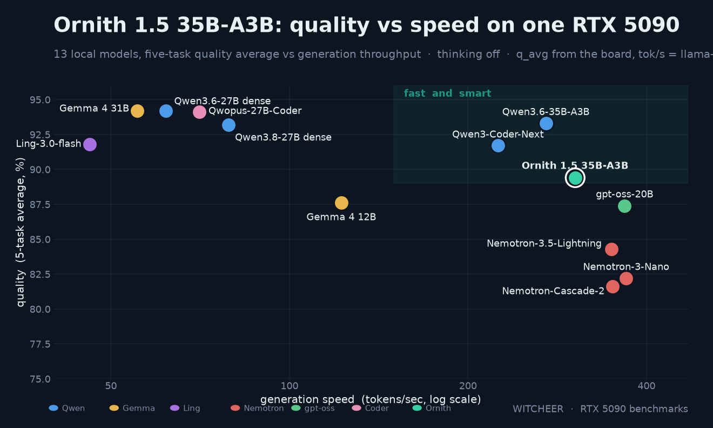

# Ornith 1.5 35B-A3B on one RTX 5090: dense-27B-class answers at 3.8x the decode speed

**TL;DR.** Ornith 1.5 35B-A3B (MoE, ~3B active) at the vendor's first-party Q4_K_M fits an RTX 5090 in 21.4 GiB and decodes at **303 tok/s** — ~3.8x the dense Qwen3.8-27B rung on the same card. It pays ~3.8 points on the five-task board (89.4 vs 93.2) but holds the harder floor: **GPQA-diamond 52.0 think-off / 81.8 think-on**, level with the dense rung in both regimes (50.5 / 80.8). The NVFP4 build reproduces the board within noise (89.3) at ~300 tok/s via vLLM, so llama.cpp and vLLM are both live serving paths. One negative result: the shipped MTP speculative head measures **slower** than base decode on vLLM 0.25.1 (245-254 vs ~300 tok/s).

## Setup

- **Hardware:** RTX 5090 32GB (sm_120), single card, single stream.
- **GGUF leg:** vendor first-party Q4_K_M, 20.21 GiB on disk, llama.cpp b9653, fully VRAM-resident (peak 21.4 GiB). Speed via llama-bench; quality via llama-server chat completions on the standing five-task harness (MMLU/HellaSwag 50% stratified sample seed 42, ARC-C/GSM8K/HumanEval full), greedy, **thinking off**.
- **NVFP4 leg:** compressed-tensors NVFP4 build (23.4 GB), vLLM 0.25.1 on the native cutlass sm_120 FP4 path, same harness over `/v1`.
- **GPQA-diamond:** standing second-tier metric (198 items, zero-shot, deterministic option shuffle, greedy). One item is ~0.5 pts; gaps under ~3 pts are noise.
- Ornith 1.5 is a reasoning model; every quality number here is **think-off** for board parity. Think-off scores understate what the model does with its reasoning channel on, and none of these numbers are comparable to think-on sampled vendor-card figures.

## Speed (Q4_K_M, llama.cpp)

| test | tok/s |
|---|---|
| pp512 | 8,952.96 ± 52.92 |
| pp16384 | 8,436.28 ± 29.60 |
| tg128 | **303.21 ± 2.16** |
| tg128 @ d8192 | 282.61 ± 3.38 |
| tg128 @ d32768 | 258.20 ± 1.16 |

Depth rows are from the day-0 sweep (same build, tg128 measured 295.6 that day; the two runs bracket ~300). Holding 87% of empty-context decode at 32k depth is a flat curve for this class, consistent with the hybrid-attention design.

Same-GPU MoE context: Qwen3.6-35B-A3B UD-Q4_K_M does 271 tok/s, the smaller Nemotron A3B pair 351-364. The dense contrast is the story: Qwen3.8-27B Q4_K_M decodes at 78.9 tok/s on this card, so the MoE is ~3.8x faster.

## Quality (think-off, greedy)

| task | Ornith 1.5 35B Q4_K_M | Ornith 1.5 35B NVFP4 | Qwen3.8-27B Q4_K_M (dense) |
|---|---|---|---|
| MMLU | 82.24 | 81.80 | 85.01 |
| ARC-Challenge | 94.11 | 94.88 | 96.76 |
| HellaSwag | 91.00 | 90.94 | 94.30 |
| GSM8K | 91.66 | 92.27 | 97.12 |
| HumanEval | 87.80 | 86.59 | 92.68 |
| **q_avg** | **89.36** | **89.30** | **93.17** |
| **GPQA-diamond** | **52.02** | not run | 50.51 |

Two reads:

1. **The MoE trade costs easy-board points, not reasoning floor.** ~3.8 q_avg under the dense rung, spread across all five tasks — but GPQA-diamond is level with it (52.0 vs 50.5 is inside the 3-pt noise floor). This is the mirror image of an aggressive-quant trade measured the same week on this rig, where the easy board barely moved and GPQA paid heavily. The board and the second-tier metric keep disagreeing in informative ways; run both.
2. **NVFP4 is quality-parity here.** 89.30 vs 89.36, every per-task delta ≤ 1.2. Same pattern as the other NVFP4 pairs on this board.

Long-context retrieve-and-use (15 tasks/depth): 97.78 overall — 100 @16K, 93.33 @32K, 100 @64K. The dense rung scores 100 flat; the 32K dip is one task, single run.

## Think-on addendum (added same day)

GPQA-diamond re-run with the reasoning channel on (max_tokens 16384, ctx 24576, zero-shot, greedy — the identical recipe used for the Qwen3.8-27B think-on calibration legs):

| model | GPQA think-off | GPQA think-on | delta |
|---|---|---|---|
| **Ornith 1.5 35B Q4_K_M** | 52.02 | **81.82** | +29.8 |
| Qwen3.8-27B Q8_0 (dense) | 47.0 | 80.81 | +33.8 |
| Qwen3.8-27B Q6_K (dense) | 48.99 | 79.29 | +30.3 |
| Qwen3.8-27B UD-IQ3_XXS (dense) | 45.0 | 78.79 | +33.8 |

Thinking is worth ~30 GPQA points on this model, the same band the dense ladder measured. Ornith lands at the top of the think-on field (81.8 vs 79.3-80.8), though the spread is inside the 3-pt noise floor — the honest read is *level with the dense 27B rungs, at 3.8x their decode speed*. Parse failures: 14/198, in line with the dense think-on legs (14-19). One regime note: these are greedy zero-shot numbers on the 198-item set; vendor-card GPQA figures are typically sampled with larger budgets and are not directly comparable.

## NVFP4 speed, and the MTP surprise

Chat-server convention (decode_tps = completion/(total-ttft), single stream — not llama-bench tg128; medians of 3):

| shape | base | MTP spec-decode |
|---|---|---|
| short-in / long-out | 300.7 | 248.0 |
| long-in / short-out | 300.1 | 245.5 |
| 8k prompt depth | 297.6 | 253.9 |
| 32k prompt depth | 284.7 | 248.9 |

Base NVFP4 decode is ~300 tok/s and nearly flat with depth. The shipped **MTP speculative head is a net loss on vLLM 0.25.1**: every shape measures 15-18% below base. At ~300 tok/s base on an MoE with ~3B active parameters, the draft-and-verify overhead has almost no headroom to pay for itself; this mirrors the Nemotron-Lightning spec-decode result on this rig, where both shipped drafters also measured negative on the 5090 at batch 1. Spec-off is the right serve config on this stack today. Worth retesting on newer vLLM.

## Worth it?

**Worth it if** you want dense-27B-class answers at almost 4x the decode speed on one consumer card: 21.4 GiB resident leaves ~10 GiB headroom, depth decay is mild, and both llama.cpp and vLLM serve it well. **Not worth it if** you need every point on knowledge-heavy short-context tasks — the dense 27B rung still wins the board by ~4 points, and the smaller Nemotron A3B pair is 16-19% faster if raw MoE speed is the only axis (at ~5 board points below Ornith).

## Honest limits

- The five-task board is think-off for comparability with the banked rows; GPQA now carries both regimes (52.0 off / 81.8 on). A think-on board pass is the remaining gap.
- The 9B sibling is now benched: [Ornith 1.5 9B report](ornith-1-5-9b.md) — the 35B dominates it on every measured axis on this card.
- No Qwen3.6-35B-A3B depth sweep yet for a like-for-like depth curve.
- GPQA-diamond is 198 items; treat sub-3-pt gaps as noise.
- Long-context and depth rows are single-run.

## Sources

`results/ornith-35b/{speed,quality,gpqa,longcontext_detail}.json`, `results/ornith-35b-nvfp4/{quality_nvfp4,speed_nvfp4,speed_mtp}.json`, day-0 depth sweep 2026-08-20. llama.cpp b9653; vLLM 0.25.1; rig harness as pinned in this repo.
