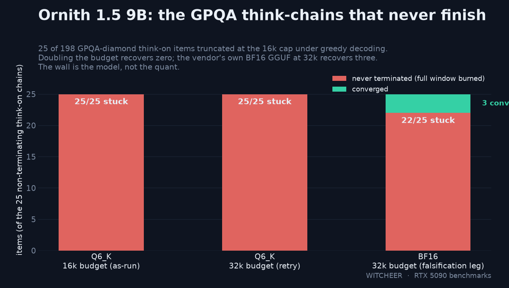

# Ornith 1.5 9B on one RTX 5090: 1 in 8 think-chains never terminates, and full precision doesn't fix it

**TL;DR.** Ornith 1.5 9B (dense, hybrid-attention, 8.95B) at the vendor's first-party Q6_K scores **83.5** on the five-task board think-off and **GPQA-diamond 41.9 think-off / 74.2 think-on**. The headline is the think-on failure mode: **25 of 198 GPQA chains (12.6%) never terminate** — not at the 16k budget, not at 32k, all 25 burning the full window under greedy decoding. The obvious suspect was the quant, so the same 25 items were re-run on the vendor's own BF16 GGUF at 32k: **22 of 25 still never terminate**. The wall is the model under this regime, not the quantization. On the chains that do finish, accuracy is 85% (147/173) — termination, not knowledge, is what breaks. The 35B-A3B sibling dominates the 9B on every axis on this card: more board points (89.4 vs 83.5), more GPQA in both regimes, and ~1.6x the decode speed.

## Setup

- **Hardware:** RTX 5090 32GB (sm_120), single card, single stream.
- **Model:** Ornith 1.5 9B, dense hybrid-attention arch (same `qwen3_5`-family design as the 35B-A3B sibling: linear attention on 3 of every 4 layers). Vendor first-party GGUFs: Q4_K_M (5.24 GiB), Q6_K (6.85 GiB), BF16 (16.7 GiB) — all from the official repo, llama.cpp b9653, fully VRAM-resident.
- **Board:** standing five-task harness (MMLU/HellaSwag 50% stratified sample seed 42, ARC-C/GSM8K/HumanEval full), greedy, **think-off** for board parity, on the Q6_K headline rung.
- **GPQA-diamond:** standing second-tier metric (198 items, zero-shot, deterministic option shuffle, greedy). Think-on leg: max_tokens 16384, ctx 24576 — the identical recipe as every think-on calibration leg on this board. One item is ~0.5 pts; gaps under ~3 pts are noise.
- Measured 2026-08-22→24.

## Speed (llama.cpp b9653)

| test | Q4_K_M | Q6_K |
|---|---|---|
| pp512 | 11,937.64 ± 497.16 | 10,163.54 ± 363.92 |
| tg128 | **225.22 ± 0.39** | **187.71 ± 0.23** |
| tg128 @ d8192 | 208.80 ± 0.31 | 176.24 ± 0.34 |
| tg128 @ d32768 | 193.83 ± 0.28 | 165.95 ± 0.22 |

Holding 86-88% of empty-context decode at 32k depth — the same flat hybrid-attention curve the 35B sibling shows. But note the family irony: the dense 9B decodes at 188-225 tok/s while the 35B MoE (~3B active) does 303. On a card that fits both, the bigger model is also the faster one.

## Quality (Q6_K, greedy)

| task | Ornith 1.5 9B Q6_K | Ornith 1.5 35B Q4_K_M | Qwen3.8-27B Q6_K (dense) |
|---|---|---|---|
| MMLU | 78.23 | 82.24 | 85.30 |
| ARC-Challenge | 93.43 | 94.11 | 96.70 |
| HellaSwag | 86.52 | 91.00 | 94.30 |
| GSM8K | 86.20 | 91.66 | 97.50 |
| HumanEval | 73.17 | 87.80 | 94.50 |
| **q_avg** | **83.51** | **89.36** | **93.66** |
| GPQA-diamond think-off | 41.92 | 52.02 | 48.99 |
| GPQA-diamond think-on | 74.24* | 81.82 | 79.29 |

*as-run at the standing 16k budget, with the termination caveat below.

Board read: 83.5 lands in the Nemotron-Lightning band, ~5.9 under its own 35B sibling, with HumanEval paying the most (73.2). Think-off GPQA 41.9 is bottom of the measured field. Thinking is worth **+32.3 GPQA points** (41.9 → 74.2), the same ~30-pt band as every reasoner measured on this rig — the model genuinely runs on its reasoning channel.

## The termination wall

The think-on leg finished with 25 of 198 items (12.6%) truncated at the 16k cap — every one a chain that never emitted an answer. For comparison, the 35B sibling and the three dense 27B think-on legs truncate 14-19 of 198 under the identical recipe. Three follow-up legs isolated the cause:

| leg | budget | converged | still truncated |
|---|---|---|---|
| Q6_K (as-run) | 16k | 0/25 | 25/25 |
| Q6_K retry | 32k | 0/25 | 25/25 |
| **BF16 (vendor GGUF)** | 32k | **3/25** | **22/25** |

1. **Parse audit (Q6_K, 16k):** all 25 are hard truncations mid-reasoning, not extraction misses. A lenient re-read of the same outputs rescues zero — the chains end in visible loops ("Wait, I'm confusing myself. Let me very carefully think about this.") and one item degenerates into verbatim repetition of a DNA string until the window dies.
2. **Doubling the budget does nothing (Q6_K, 32k):** 0/25 converged. These are not chains that needed 20k tokens; they are chains that do not stop.
3. **Full precision does almost nothing (BF16, 32k):** the falsification leg for the "quant broke it" hypothesis. Same prompts, same shuffle seed, same greedy regime, the only moved variable is precision — and 22/25 still burn the full 32k window. The three chains that do converge finish at 709, 2,740 and 8,096 tokens, budgets where Q6_K never terminated on the same items, so a residual precision effect exists on the margin. But at 3/25 recovered it is a footnote, not the cause.

**Verdict: the non-termination is a property of the model under greedy decoding, not of the quantization.** The vendor's published GPQA-diamond for this model is 86.4 (5-run average on their harness, [ornith.ai/ornith_1_5.html](https://ornith.ai/ornith_1_5.html)); that regime samples at temperature with different extraction, which plausibly breaks the repetition loops greedy falls into. The honest local read: under the deterministic regime this board runs for comparability, an eighth of hard-item chains simply never finish, and the as-run 74.2 carries them all as wrong. On the 173 chains that terminated, accuracy is 85.0% — with the caveat that the 25 non-terminating items skew hard, so that conditional number flatters the model.

A quiet extraction note: on several BF16 non-terminating chains the answer extractor still pulled the correct letter out of the truncated reasoning (3 of the 22, e.g. items that had settled on an answer and kept second-guessing). Extraction salvage does real work in truncation-heavy regimes; worth remembering when comparing harnesses.

## Worth it?

**Worth it if** you're VRAM-poor: the Q6_K is a 6.85 GiB file that fits 8-12GB cards with room for context, decodes at 188 tok/s on this card, and the reasoning channel genuinely delivers (+32 GPQA). **Not worth it if** you have 24GB+: the 35B-A3B sibling beats it on every measured axis at once — +5.9 board, +10.1 GPQA think-off, +7.6 think-on, ~1.6x decode — and even its termination behaviour is healthier (14 vs 25 truncations). On this card there is no lane where the 9B wins. And in any harness that extracts answers strictly under greedy decoding, budget the termination wall: ~1 in 8 hard-item chains will spin until the window ends.

## Honest limits

- The board row is Q6_K only; Q4_K_M got the speed sweep but no quality leg.
- No long-context retrieve-and-use eval on the 9B (the depth speed sweep ran; quality-at-depth did not).
- The BF16 leg re-ran only the 25 non-terminating items, not the full 198 — it answers the falsification question, not "what does BF16 score".
- Greedy zero-shot throughout; the vendor's 86.4 is a sampled multi-run figure on their harness and is not comparable.
- GPQA-diamond is 198 items; treat sub-3-pt gaps as noise.

## Sources

`results/ornith-9b/{quality,gpqa,speed_q4,speed_q6}.json`, `results/ornith-9b-thinkon/{gpqa,parse_audit,budget_32k,bf16_check}.json`. llama.cpp b9653; vendor GGUFs (Q4_K_M/Q6_K/BF16, byte-verified against the HF API); rig harness as pinned in this repo. 35B comparison rows: [Ornith 1.5 35B report](ornith-1-5-35b.md).
