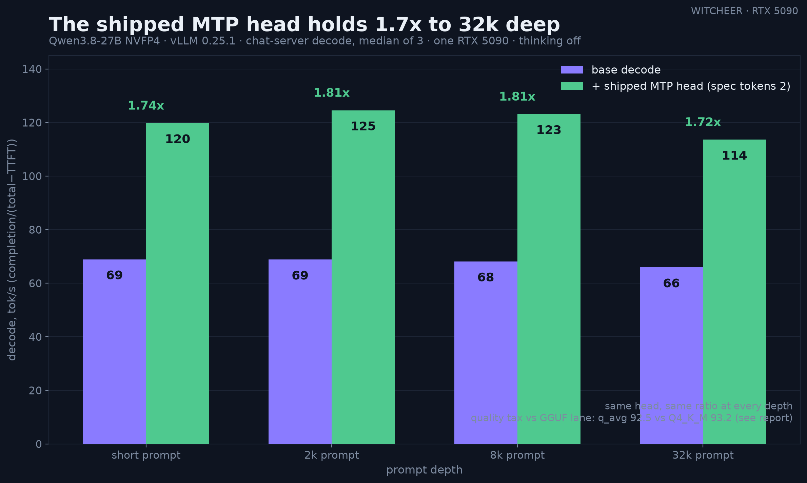

# Qwen3.8-27B NVFP4: quality tax vs the GGUF ladder, but the shipped MTP head finally pays

**Date:** 2026-08-17 · **GPU:** one RTX 5090 (32GB, sm_120) · **Engine:** vLLM 0.25.1 (compressed-tensors NVFP4, FlashInfer sm_120 path) · **Checkpoint:** [unsloth/Qwen3.8-27B-NVFP4](https://huggingface.co/unsloth/Qwen3.8-27B-NVFP4) (22.6GB, ships a separate 0.85GB `model_mtp.safetensors` speculative head) · **Mode:** thinking off, greedy, five-task board harness (MMLU · ARC-C · HellaSwag · GSM8K · HumanEval), same items over HTTP as every board row.

The [seven-rung GGUF ladder](qwen3-8-27b-quant-ladder.md) established the llama.cpp side of Qwen3.8-27B: tight ladder, q_avg 90.8–93.7 across a 3.4x size range. This report adds the NVFP4 lane — the only lane on this box where the vendor's shipped MTP speculative head actually runs.

## Run context

Single unattended run, 2026-08-17 07:22–09:01 CEST, night-lib rails, vLLM 0.25.1 in a pinned venv (`VLLM_NVFP4_GEMM_BACKEND` default, FlashInfer JIT sm_120 kernels), Donald drained for the serving window and restored on exit. Checkpoint integrity verified by sha256 against the HF resolve endpoint's `x-linked-etag` (the repo was re-cut upstream between 2026-08-16 15:00 and 21:42 — a previous night's attempt failed its size assert on the stale pin; nothing about the measurement stack differed). Quality board 93 minutes; speed shapes 3 runs each, median reported.

## Quality: below Q4_K_M at Q6_K size

| Lane | File | MMLU | ARC-C | HellaSwag | GSM8K | HumanEval | q_avg |
|------|-----:|-----:|------:|----------:|------:|----------:|------:|
| Q6_K (GGUF) | 21.3GB | 85.3 | 96.7 | 94.3 | 97.5 | 94.5 | **93.7** |
| Q4_K_M (GGUF) | 15.9GB | 85.0 | 96.8 | 94.3 | 97.1 | 92.7 | **93.2** |
| UD-IQ3_XXS (GGUF) | 11.1GB | 84.3 | 96.3 | 93.8 | 96.8 | 92.1 | **92.7** |
| **NVFP4 (vLLM)** | 22.6GB | 84.3 | 96.9 | 94.3 | 97.1 | 89.6 | **92.5** |

The NVFP4 checkpoint is Q6_K-sized and lands below Q4_K_M — a hair under UD-IQ3_XXS, which is half the file. HumanEval carries almost the whole tax (89.6 vs 94.5 at Q6_K; the four other tasks are within noise of the Q4 rungs). Quality is apples-to-apples: same harness, same items, over HTTP.

## Speed: ~69 tok/s base, 1.7x with the shipped MTP head, held to 32k

Chat-server convention (decode_tps = completion/(total−TTFT)); **not** comparable 1:1 with llama-bench tg128 in the ladder report — the convention reads conservatively. 3 runs per shape, medians:

| Shape | base decode | MTP decode | ratio | base TTFT | MTP TTFT |
|-------|------------:|-----------:|------:|----------:|---------:|
| short-in / long-out | 68.95 | 119.8 | 1.74x | 75ms | 75ms |
| 2k-in / short-out | 68.83 | 124.6 | 1.81x | 201ms | 236ms |
| 8k depth | 68.17 | 123.2 | 1.81x | 780ms | 854ms |
| 32k depth | 65.93 | 113.6 | 1.72x | 4.09s | 4.40s |

Two reads:

1. **The MTP head engages and stays engaged.** `--speculative-config '{"method":"mtp","num_speculative_tokens":2}'` against the shipped `model_mtp.safetensors`: 1.72–1.81x across every shape, including 32k-deep prompts. This is the first vendor-shipped speculative module on this box that pays its own way — prior MTP legs either failed to engage (all-1.00x tell) or lost their gains under depth.
2. **The depth curve is flat, again.** Base decode drops 4.4% from short prompts to 32k depth (68.95 → 65.93), consistent with the hybrid-attention story from the llama.cpp depth sweep (−9.6% at 32k there). The architecture's long-context decode claim survives a second, independent serving stack.

## Verdict

On a consumer sm_120 card the NVFP4 checkpoint is not the quality play: same VRAM as Q6_K, less quality than Q4_K_M, with HumanEval degrading most. It is currently the *throughput* play — ~114–125 tok/s effective decode with the shipped MTP head at depths where the GGUF lane's Q6_K runs 63 tok/s draft-free — bought at that quality tax plus a stack switch. If llama.cpp lands support for this family's MTP head, the calculus changes; today the two lanes trade quality against speed and you pick per workload.

## Honest limits

- Speed comparison across lanes is cross-stack (vLLM chat-server vs llama-bench); the quality comparison is same-harness and clean.
- One checkpoint, one card, one vLLM version; NVFP4 kernel maturity on sm_120 is moving fast and these numbers date accordingly.
- Long-context *quality* (the retrieve-and-use battery from the [depth addendum](qwen3-8-27b-quant-ladder.md)) was not run on this lane; the depth numbers here are decode speed only.
- num_speculative_tokens=2 only; deeper speculation untested.
