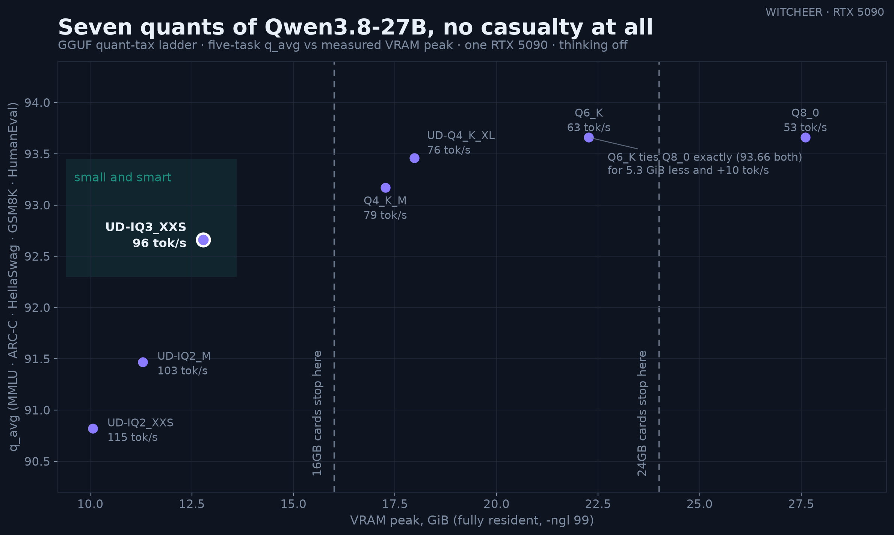
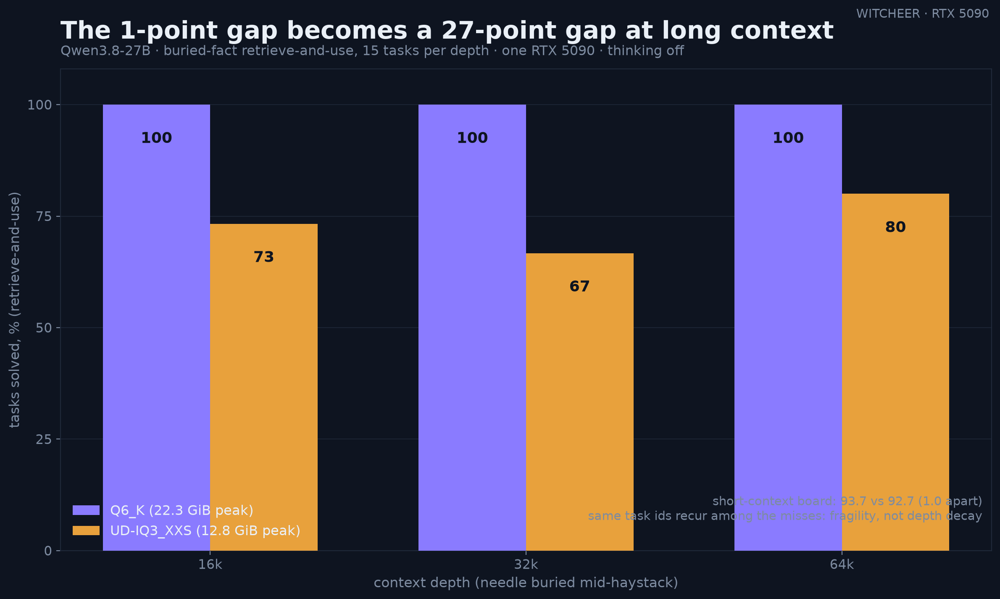

# Qwen3.8-27B: the seven-rung quant-tax ladder

**Date:** 2026-08-14/15 · **GPU:** one RTX 5090 (32GB, sm_120) · **Engine:** llama.cpp b9653 (`9dbc6621a`), CUDA, flash attention on, `-ngl 99` (fully VRAM-resident every rung) · **GGUFs:** [unsloth/Qwen3.8-27B-GGUF](https://huggingface.co/unsloth/Qwen3.8-27B-GGUF) (day-0 cuts, UD = unsloth dynamic imatrix recipe) · **Mode:** thinking off, greedy, five-task board harness (MMLU · ARC-C · HellaSwag · GSM8K · HumanEval).

Qwen3.8-27B is the dense-hybrid successor in the Qwen3.x line: `qwen3_5` architecture, 27.32B parameters, linear attention on three of every four layers (per the shipped `config.json`), which is the design change its release notes credit for long-context decode behaviour. Day-0 speed numbers went out on 2026-08-14 ([pp512 3901.5, tg128 77.9 tok/s at Q4_K_M](../dataset/benchmarks.csv)); this report adds the quality board at seven quant rungs, from a 8.4GB 2-bit file to full Q8_0.

## Run context

All seven rungs measured on the same pinned stack (rig harness, llama-server b9653, identical suite prompts, temp 0). Six ladder rungs ran unattended overnight 2026-08-15 (06:54–16:33 CEST, night-lib rails, all six rc=0 with fresh artifacts). The Q4_K_M quality leg is a same-stack rerun banked 18:10 CEST the same day: its original 2026-08-14 day-0 run lost the quality board to a transient DNS failure on the box mid-suite (speed leg unaffected and already published); nothing about the recipe differed in the rerun.

## Results

| Rung | File | VRAM peak¹ | MMLU | ARC-C | HellaSwag | GSM8K | HumanEval | q_avg | tg128 |
|------|-----:|-----------:|-----:|------:|----------:|------:|----------:|------:|------:|
| UD-IQ2_XXS | 8.4GB | 10.1 GiB | 82.0 | 95.7 | 92.3 | 95.1 | 89.0 | **90.8** | 114.6 |
| UD-IQ2_M | 9.6GB | 11.3 GiB | 83.7 | 94.9 | 93.7 | 96.7 | 88.4 | **91.5** | 103.3 |
| UD-IQ3_XXS | 11.1GB | 12.8 GiB | 84.3 | 96.3 | 93.8 | 96.8 | 92.1 | **92.7** | 96.2 |
| Q4_K_M | 15.9GB | 17.3 GiB | 85.0 | 96.8 | 94.3 | 97.1 | 92.7 | **93.2** | 78.9 |
| UD-Q4_K_XL | 16.7GB | 18.0 GiB | 85.1 | 96.6 | 94.4 | 97.3 | 93.9 | **93.5** | 76.2 |
| Q6_K | 21.3GB | 22.3 GiB | 85.3 | 96.7 | 94.3 | 97.5 | 94.5 | **93.7** | 63.1 |
| Q8_0 | 27.0GB | 27.6 GiB | 85.2 | 96.8 | 94.4 | 97.4 | 94.5 | **93.7** | 53.1 |

¹ nvidia-smi peak during the llama-bench sweep at default bench context; full per-test prefill rows (pp128–pp16384) in [`dataset/benchmarks.csv`](../dataset/benchmarks.csv).

## Depth addendum: the ladder's tightness does not survive long context (added 2026-08-16)

A reader asked whether the IQ3_XXS gap widens at long context. Measured same-day: the rig's long-context retrieve-and-use battery (15 tasks per depth — a fact buried mid-haystack under agent load, the model must find it with a tool and use it) at 16k/32k/64k, UD-IQ3_XXS vs Q6_K, identical stack to the ladder.

| depth | UD-IQ3_XXS | Q6_K |
|------:|-----------:|-----:|
| 16k | 11/15 (73.3) | 15/15 (100) |
| 32k | 10/15 (66.7) | 15/15 (100) |
| 64k | 12/15 (80.0) | 15/15 (100) |
| **total** | **33/45 (73.3)** | **45/45 (100)** |

Two reads:

1. **A gap the short-context board cannot see.** On the five-suite board these rungs sit 1.0 q_avg apart (92.7 vs 93.7); under long-context load Q6_K is perfect at every depth while IQ3_XXS drops roughly a quarter of the tasks. The ladder's headline ("no cliff") is a short-prompt statement — the low rungs pay a real long-context tax the q_avg column does not show.
2. **The deficit is depth-flat, not depth-growing.** IQ3_XXS scores 73/67/80 across 16k/32k/64k — no monotonic slide, and the same task ids recur among its misses (lc-001 at all three depths). So the mechanism looks like quant-induced fragility on retrieval-under-load generally, switched on as soon as context is long, rather than decay that keeps worsening with every extra 16k.

Honest limits: n=15 per depth per rung, one task family (needle retrieve-and-use), two rungs A/B'd — the middle rungs and other long-context task shapes are unmeasured. 64k is the top tested depth (KV budget at Q6_K: the 64k+margin server peaked well inside 32GB).

## Depth addendum II: the full column, and a correction (added 2026-08-18)

The A/B above promised the middle of the ladder; here it is. Same battery (15
retrieve-and-use tasks per depth at 16k/32k/64k, per-depth self-sized servers,
identical stack), run on the four remaining VRAM-safe rungs. Q8_0 stays
untested: the 27GB file plus 64k KV does not fit 32GB.

| rung | file | 16k | 32k | 64k | total |
|------|-----:|----:|----:|----:|------:|
| Q4_K_M | 15.9GB | 15/15 | 15/15 | 15/15 | **45/45** |
| UD-Q4_K_XL | 16.7GB | 15/15 | 15/15 | 15/15 | **45/45** |
| Q6_K | 21.3GB | 15/15 | 15/15 | 15/15 | **45/45** |
| UD-IQ2_M | 9.6GB | 15/15 | 15/15 | 15/15 | **45/45** |
| UD-IQ2_XXS | 8.4GB | 11/15 | 13/15 | 15/15 | **39/45** |
| UD-IQ3_XXS | 11.1GB | 11/15 | 10/15 | 12/15 | **33/45** |

Because IQ3_XXS was suddenly the outlier rather than the trend, I reran it
same-day before writing anything: **33/45 again, and the 12 missed task ids
are identical between the two runs.** At temp 0 that establishes the result is
deterministic — not a transient server fault — though it cannot rule out that
this fixed task set happens to sit badly for this one quant.

**This revises the A/B's read.** With only two points, the natural reading
was that depth risk scales with file size. The full column says
otherwise: UD-IQ2_M (9.6GB) is perfect at every depth while UD-IQ3_XXS
(11.1GB, a bigger file) fails a quarter of the tasks. The depth tax follows
the quantisation recipe, not the file size — which specific tensors each
recipe squeezes evidently matters more at depth than how hard it squeezes
overall. Practical consequence: depth-test the exact file you plan to run;
its size class tells you nothing here.

Honest limits: n=15 per depth per rung, one task family, single seed
(deterministic decode), 64k top depth, Q8_0 untested.

## GPQA addendum: the ladder splits on a hard benchmark too (added 2026-08-17)

A reader (EschaLabs) made the complementary point to the depth question: the five-task board is saturated at 92-97 on this model, so how much of the ladder's tightness is the benchmark's ceiling rather than the quants' equivalence? Measured same-day: GPQA-diamond (198 graduate-level items, zero-shot, think-off, deterministic option shuffle, same server stack as the ladder) across all seven GGUF rungs plus the [NVFP4 lane](qwen3-8-27b-nvfp4.md).

| Rung | GPQA-diamond | board q_avg |
|------|-------------:|------------:|
| Q4_K_M | **50.5** | 93.2 |
| Q6_K | **49.0** | 93.7 |
| UD-Q4_K_XL | **49.0** | 93.5 |
| NVFP4 (vLLM) | **47.0** | 92.5 |
| Q8_0 | **47.0** | 93.7 |
| UD-IQ3_XXS | **45.0** | 92.7 |
| UD-IQ2_XXS | **42.9** | 90.8 |
| UD-IQ2_M | **39.4** | 91.5 |

Sample-size caveat first: 198 items means one item is half a point, and gaps under ~3 points are noise. Reading only past that band:

1. **The spread nearly quadruples: 2.9 board points become 11.1 GPQA points.** The ladder the board calls tight is not tight when the benchmark has headroom. Together with the depth addendum this is the second independent axis (difficulty, after context load) on which quant damage shows up that the saturated board hides.
2. **The 4-bit band is the ceiling, and the floor drops hard.** Q4_K_M/Q6_K/UD-Q4_K_XL sit in one noise band at 49-50.5 (Q4_K_M's nominal lead over Q6_K is 1.5 points — noise). The IQ2 rungs lose 6-10 points from that band, far more than the 1.9-2.9 the board showed.
3. **The two IQ2 rungs swap order** (IQ2_XXS 42.9 over IQ2_M 39.4, reversing their board order). The gap is 3.5 points — at the edge of the noise band, so we flag rather than lean on it, but it cautions against ranking neighbouring 2-bit rungs on any single 198-item read.
4. **Q8_0's 47.0 sits 2 points under Q6_K — inside the noise band** (and their board tie already said the top of the ladder is flat). Single-seed variance at this sample size; a multi-seed rerun would be needed before reading anything into it.

GPQA-diamond is a standing second-tier metric on this rig from this date: reported alongside q_avg on future treatments, never folded into it (which would break comparability with every earlier board row).

## BF16 addendum: the true reference point (added 2026-08-20)

Every read above measured quants against the best quant. This closes the loop: the full-precision BF16 checkpoint (split GGUF, 54.7GB — 1.7x the card) run through the identical five-task board plus GPQA-diamond via llama.cpp partial offload (`-ngl 40`), thinking off, same pinned stack. Quality-only by design: partial-offload decode speed says nothing about the resident rungs, so no speed rows exist for this leg. Banked across three overnight windows (2026-08-17 → 08-20, checkpoint resumes on MMLU/GPQA/GSM8K, ~19.4h of eval time).

| | File | MMLU | ARC-C | HellaSwag | GSM8K | HumanEval | q_avg | GPQA-diamond |
|--|-----:|-----:|------:|----------:|------:|----------:|------:|-------------:|
| **BF16** | 54.7GB | 85.3 | 96.8 | 94.3 | 97.4 | 93.9 | **93.5** | 48.5 |
| Q6_K | 21.3GB | 85.3 | 96.7 | 94.3 | 97.5 | 94.5 | **93.7** | 49.0 |
| Q4_K_M | 15.9GB | 85.0 | 96.8 | 94.3 | 97.1 | 92.7 | **93.2** | 50.5 |

Three reads:

1. **BF16 lands mid-ladder.** 93.5 ties UD-Q4_K_XL to the decimal and sits 0.1 under the Q6_K/Q8_0 pair (93.66) — differences of one or two problems per suite. The whole 4-bit-and-up band was already at the full-precision ceiling; the "no cliff" headline was never grading quants against a degraded reference.
2. **GPQA agrees from the hard end.** BF16's 48.5 sits inside the 4-bit band's 49–50.5 noise band (198 items: gaps under ~3 points are noise). Two consequences: the 4-bit rungs match full precision even where the benchmark has headroom, and the IQ2 floor (39.4–42.9) is now measured against a true reference — a genuine 5.6–9.1 point loss, not an artifact of comparing quants to each other.
3. **Quants nominally out-scoring BF16 (HumanEval 94.5 vs 93.9, GPQA Q4_K_M 50.5 vs 48.5) is the noise band showing itself.** Single seed, deterministic decode: anything under half a board point or ~3 GPQA points is over-reading. The table above is an equivalence result, not a ranking.

Honest limits: partial offload runs a different CPU/GPU kernel split than the resident rungs — numerically equivalent in principle at temp 0, but not bit-identical execution; single-seed, and the HellaSwag leg is the board's standard 50% sample. Speed intentionally unmeasured.

## Reads

1. **No cliff anywhere.** The full spread from Q8_0 to 2-bit XXS is 2.9 q_avg points across a 3.4x file-size range. For contrast, the same harness put Nemotron Lightning's floor rung 1.7 points below its neighbour in one step, and Qwen3.6-27B's ladder paid its first real step at Q3. Here every step down is 0.2–1.2 points, spread across suites rather than concentrated in one.
2. **Q6_K ties Q8_0 to the second decimal** (93.66 both, per-suite deltas ≤0.17). Q8_0 buys 5.7GB of nothing on this board; Q6_K is the effective top of the ladder.
3. **UD-Q4_K_XL is the sweet spot for 24GB cards**: 93.5 at 18.0 GiB peak and 76 tok/s — 0.2 under Q6_K for 4.3 GiB less. Plain Q4_K_M is board-equal (93.2) and the faster pick (79 tok/s) where the 0.3 doesn't matter.
4. **UD-IQ3_XXS is the 16GB-card headline**: 92.7 — one point under Q8_0 — from an 11.1GB file at 12.8 GiB peak and 96 tok/s. A 27B dense model holding 92%+ of the five-task board inside a 16GB card's budget is the strongest small-card result this rig has measured on a dense model.
5. **Even the 2-bit floor holds ~91.** UD-IQ2_XXS keeps GSM8K at 95.1 and loses most of its tax in MMLU (82.0, −3.2 vs Q8). At 115 tok/s and a 10.1 GiB peak it is a usable 27B on a 12GB card at short context, though the IQ2 rungs' HumanEval dip (89.0/88.4 vs 92+ everywhere above) says code is where 2-bit pinches first.
6. **MMLU does most of the falling** (85.2 → 82.0 top to bottom); ARC-C, HellaSwag and GSM8K are near-flat until the very floor. Same shape as the Qwen3.6-27B ladder: knowledge recall pays the quant tax before reasoning does.
7. **Speed is bytes, as always**: tg128 runs 53 → 115 tok/s in near-perfect inverse proportion to file size (memory-bound decode), while prefill stays in one 3.2–3.9k band across the ladder (compute-bound, quant-insensitive).

## Honest limits

- The UD rungs use unsloth's dynamic imatrix recipe; the Q6_K/Q8_0/Q4_K_M rungs are static cuts from the same repo. Recipe and bit-width move together at the bottom of this ladder, so "2-bit costs 2.9" conflates both (the recipe-coverage lesson from the Qwen3.6 NVFP4 rows applies).
- Day-0 GGUFs: unsloth re-cut files in the repo's first hours (the Q4_K_M download died once to a mid-file re-upload). Files here are the cuts as of 2026-08-14 evening; a later re-cut could shift low-rung numbers.
- Thinking-off only, matching the board convention for this model family. VRAM peaks are bench-context peaks, not long-context budgets. The q_avg table is short-prompt quality; for quality at depth see the depth addendum above (the hybrid-attention decode story — day-0 depth sweep tg128 −9.6% at d=32768 — is the speed side of the same axis).
