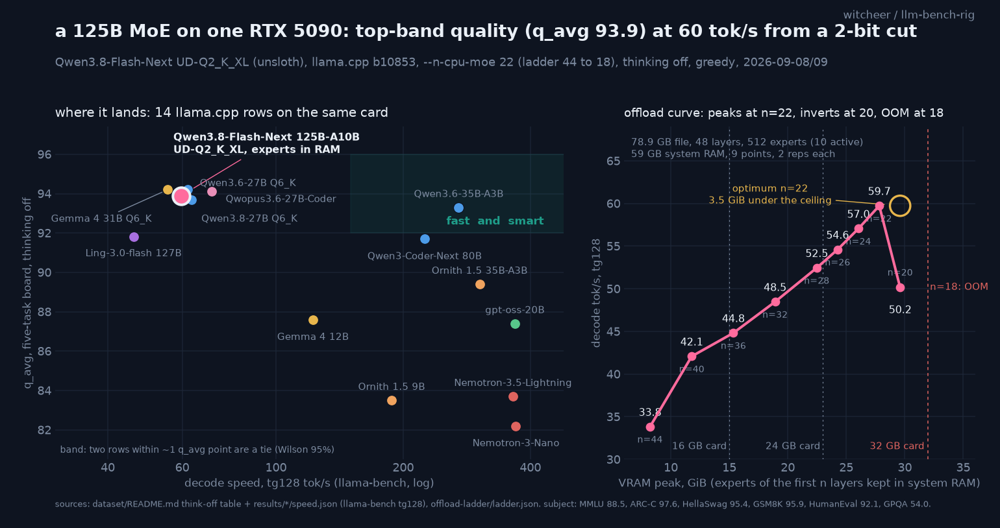

# Qwen3.8-Flash-Next on one RTX 5090: a 125B MoE at top-band quality and 60 tok/s from a 2-bit cut

**TL;DR.** Qwen3.8-Flash-Next (125B total, 10B active, 512 experts, hybrid linear attention) does not fit a 32 GB card at any quant, so this treatment runs unsloth's UD-Q2_K_XL (78.9 GB) with the routed experts of the first N layers in system RAM and everything else on the GPU (`--n-cpu-moe`; the board and GPQA ran at N=28, 23.0 GiB VRAM peak; the completed ladder puts the speed optimum at N=22, 28.5 GiB; 59 GB RAM). Result: **q_avg 93.9** on the five-task board (MMLU **88.5**, the highest MMLU on the board; ARC-C 97.6; HellaSwag 95.4; GSM8K 95.9; HumanEval 92.1), inside the top band with Gemma 4 31B Q6_K (94.2) and Qwen3.6-27B Q6_K (94.2), at **59.7 tok/s** decode at the ladder optimum (N=22), 51.0 at 32k depth. GPQA-diamond think-off **54.0**, above every dense 27B rung (49 to 51) and Ornith 35B (52). The offload curve is the practical finding: from 44 to 22 layers offloaded, every 1.8 GiB of experts moved onto the GPU bought 1 to 2 tok/s; the curve peaks at N=22 (28.5 GiB), inverts at N=20 (30.3 GiB, 50.2 tok/s) and fails to load at N=18, the same shape the Ling-3 sweep showed in August. A second finding came out of replicating the depth sweep: on this 59 GB box, N=28 sits on the page-cache edge, and prefill at depth varies 2.7x between passes; N=22 does not. The MTP speculative head (open llama.cpp PR #28243, shared Q4_K_M drafter) is **1.25x on code and repetitive text and a loss on prose and chat** in this offload regime: with experts in RAM the verification pass is expensive enough that acceptance below ~0.7 does not pay. unsloth's "1.3 to 1.7x with MTP" holds only for the predictable half of the workloads here.

## Setup

- **Hardware:** RTX 5090 32GB (sm_120), 59 GB system RAM, single card, single stream.
- **Model:** `unsloth/Qwen3.8-Flash-Next-GGUF`, `UD-Q2_K_XL` (3-shard split, 78,869,128,864 bytes, every shard size-verified against the HF API at run time), architecture `qwen4exp`, 48 layers, 512 experts with 10 active, `layer_types` 3 linear-attention to 1 full-attention. Vendor config fetched 2026-09-08.
- **Build:** llama.cpp master `b10853-9dcf84e5a`, a fresh worktree (the arch merged into master on 2026-08-27; none of the rig's four resident builds carried it, verified by grepping `libllama.so`). MTP leg on a second worktree at PR #28243 head `d1a92352c` (danielhanchen, `qwen4exp/mtp`, open at run time).
- **Offload:** `-ngl 99 --n-cpu-moe N`: dense layers, attention, and the experts of layers N onward on the GPU; the routed experts of the first N layers in system RAM. Quality legs ran at N=28 (the first sweep's floor); the completed ladder below puts the speed optimum at N=22. Quality does not depend on N (same weights, same maths, only placement), so the board row keeps its N=28 scores and takes the N=22 speed.
- **Quality:** the standing five-task board (MMLU/HellaSwag 50% stratified sample seed 42, ARC-C/GSM8K/HumanEval full), greedy, **thinking off** via `chat_template_kwargs.enable_thinking=false` (probed: the template honours it, letter-only answers come back in 2 tokens), `ctx 8192`. GPQA-diamond 198 items, zero-shot, deterministic shuffle, greedy, think-off.
- **Speed:** llama-bench pp512/tg128 with the depth sweep at the chosen N; served (HTTP) lane for the MTP leg: 8 prompts x 4 workloads, 256 tokens, temperature 0, `ctx 16384`.
- Run 2026-09-08, 08:52 to 14:10 CEST in one night-lib script (`fnext-treatment.sh`), Donald drained for the GPU phases and restored. Ladder completed 2026-09-08 23:07 to 23:17 CEST (idle-queue item `20-fnext-offload-ladder.sh`) and 2026-09-09 07:23 to 07:35 CEST (`fnext-ladder-ext.sh`, `fnext-pagecache-probe.sh`); raw per-point json under `results/qwen3-8-flash-next-ud-q2-k-xl/offload-ladder/`. Provenance block (server command, `/props`, template hash, harness sha) in `results/qwen3-8-flash-next-ud-q2-k-xl/meta.json`.

## The offload curve (complete ladder, 2026-09-08/09)

llama-bench, `-p 512 -n 128 -r 2`, VRAM peak sampled at 1 Hz. Nine points from N=44 down to the first load failure:

| `--n-cpu-moe` | tg128 tok/s | pp512 tok/s | VRAM peak | fits |
|---:|---:|---:|---:|---|
| 44 | 33.8 | 185 | 8.2 GiB | 12 GB card |
| **40** | **42.1** | 639 | **12.1 GiB** | **16 GB card** |
| 36 | 44.8 | 682 | 15.7 GiB | |
| 32 | 48.5 | 717 | 19.4 GiB | |
| **28** | **52.5** | 768 | **23.0 GiB** | **24 GB card** |
| 26 | 54.6 | 790 | 24.8 GiB | |
| 24 | 57.0 | 829 | 26.7 GiB | |
| **22** | **59.7** | **900** | **28.5 GiB** | **32 GB card, optimum** |
| 20 | 50.2 | | 30.3 GiB | loads, slower |
| 18 | fails | | | CUDA error at load |

The first pass (2026-09-08, 40 to 28 in steps of 2) and the completed ladder (2026-09-09, 44 to 18) agree to 0.1 tok/s at every shared point.

Reads:

1. **Near-linear in resident experts, then a cliff.** Each layer's experts are ~0.9 GiB at this quant; every two layers moved onto the card bought 1 to 2.5 tok/s, more per step near the top. At N=20 the card is 30.3 GiB full and decode drops to 50.2: the allocator is squeezing the compute buffers and the KV cache, and 18 does not load. Same shape as the Ling-3 curve measured on this rig in August (127B, Q3_K_M), which peaked at 27.5 GiB before inverting. Rule for a 32 GB card: the optimum is the last rung that leaves about 3.5 GiB free, not the last rung that loads.
2. **What your card gets.** Read the `fits` column with 1 GiB of headroom: a 16 GB card runs N=40 at 42 tok/s (33.9 at 32k depth), a 24 GB card N=28 at 52.5 (46 at 32k), the 5090 N=22 at 59.7 (51 at 32k). These are 5090 measurements at a VRAM budget, not measurements on those cards; a 4090's bandwidth is 56% of the 5090's, so scale the decode number down. The RAM side is the same 59 GB requirement on every card, because the file is 78.9 GB whichever way it is split.
3. **Prefill is the price.** 900 tok/s pp512 at N=22 against ~3,100 for a fully resident dense 27B; a 16k prompt costs **29.4 s** of prefill here (served, cold, p50 of 8, `recipe/a_base.summary.json`, 2026-09-09; the ~18 s this report first carried was derived from pp512@8k and is a floor under offload, corrected 2026-09-09) versus ~5 s resident. Prompt caching (measured on this rig in the spec-cache study) is what makes that bearable for a stable system prompt.

## Speed at the optimum (N=22) and at the board point (N=28)

| test | N=22, 28.5 GiB | N=28, 23.0 GiB |
|---|---:|---:|
| pp512 | 900.5 ± 43.7 | 770.1 ± 33.6 |
| tg128 | **59.7 ± 0.4** | 52.6 ± 0.2 |
| pp512 @ d8192 | 826 | 709 (see below) |
| tg128 @ d8192 | 56.1 | 50.0 |
| pp512 @ d32768 | 772 | 669 |
| tg128 @ d32768 | **51.0** | 45.9 |

Decode holds 85% of its empty-context speed at 32k depth at N=22 (87% at N=28). The fully resident Qwen3.8-27B (also hybrid linear attention) holds 92% on this card, so part of the extra decay is the offload path rather than attention. The N=28 depth figures above are the warm-cache values from three of five passes; the other two are the subject of the next section.

### The page-cache edge at N=28

The N=28 depth sweep was run five times across two days on an identical build and flag set, and prefill at 8k depth came back 356, 710, 266, 709 and 265 tok/s. Decode at 32k moved with it (42.5, 45.9, 41.0, 46.3, 40.9). tg128 at zero depth was 52.5 every time. A probe sampling the process's major page faults and `/proc/meminfo` every 2 s during one slow pass explains it: the 78.9 GB file is memory-mapped, at N=28 about 56 GB of it is expected to live in RAM on a 59 GB box, and the pass took **736,000 major faults** with MemFree under 0.5 GB throughout. The experts get evicted and re-read from NVMe mid-run, so prefill at depth (which touches the most experts per unit time) is the first thing to pay. The same probe at N=22 took 7,500 major faults, and its five depth numbers agree to within 1 tok/s across passes.

Two consequences. The `speed.json` for this row was regenerated from the N=22 sweep (warm, reproducible). And on a box with 64 GB or less of RAM, moving experts onto the GPU protects prefill as well as decode: N=28 is a valid 24 GB-card point but a fragile one here, and the honest prefill number for it is a range. A 96 GB box would not see this at all.

## Quality

| task | Flash-Next UD-Q2_K_XL | Gemma 4 31B Q6_K | Qwen3.6-27B Q6_K | Qwen3.8-27B Q6_K |
|---|---:|---:|---:|---:|
| MMLU | **88.47** | 87.8 | 87.9 | 85.3 |
| ARC-Challenge | **97.61** | 97.6 | 96.9 | 96.7 |
| HellaSwag | 95.38 | 92.0 | 95.4 | 94.3 |
| GSM8K | 95.91 | 97.5 | 97.3 | 97.5 |
| HumanEval | 92.07 | 96.3 | 93.3 | 94.5 |
| **q_avg** | **93.89** | 94.2 | 94.2 | 93.7 |
| GPQA-diamond (think-off) | **54.04** | 58.6 (Q4_0 row) | 54.5 | 49.0 |

Wilson 95% on q_avg: 93.0 to 94.8 (see `board_ci.csv`), so the three top rows are a statistical tie; the tables sort by q_avg and this row sits fourth. Parse failures: 2 across 13,010 multiple-choice answers.

Reads:

1. **Knowledge is where the parameters show.** The highest MMLU on the board, from a 2-bit file. The 125B of total weights are mostly expert knowledge, and a 2-bit quant of an expert that is only consulted on its topic loses less than a 2-bit quant of a dense layer that every token passes through, which is why UD-Q2_K_XL on a MoE lands where dense IQ2 rungs on this board lose 3 points.
2. **GSM8K and HumanEval pay the 2-bit tax.** Both sit 1.5 to 4 points under the top dense rows; the 13 HumanEval failures are tracebacks at test time (wrong results or runtime errors), not formatting. A Q3 or IQ3_XXS cut (82 GB, fits the same offload shape) would tell whether that is the quant or the model.
3. **GPQA-diamond agrees with MMLU.** 54.0 think-off is the best MoE number on the second tier and level with Qwen3.6-27B Q6_K (54.5); the 27B family's newer rungs sit at 49 to 51.

### A note on the pace gate

The board's multiple-choice instrument gate (abort if the rolling mean completion length over 25 answers exceeds 50 tokens; think-off letter answers run 1 to 7 tokens) tripped at MMLU subject 4 on the first attempt. Probing with the harness's exact message shape showed serving was clean: 2-token answers, thinking suppressed. The cause was the model itself. Every MC completion length was then logged: of 13,010 MC answers, the median is 2 tokens and **8 exceeded 50 tokens**, 7 of them the model declaring the question incomplete (MMLU items whose stem references a missing figure or passage) and one "none of the options are correct". Eight essays out of thirteen thousand is model behaviour a 25-item window can still trip on; the gate was raised to 400 for this slug and the run resumed from its progress files. No score was affected (the gate aborts, it does not alter answers).

## MTP speculative decoding (PR #28243 build)

Served lane at N=28, `ctx 16384`, p50 decode tok/s over 8 prompts per cell:

| workload | plain | MTP n=2 (shared Q4_K_M head) | acceptance |
|---|---:|---:|---:|
| prose | 47.5 | 44.6 (0.94x) | 0.61 |
| chat | 47.3 | 46.5 (0.98x) | 0.68 |
| code | 48.6 | **61.1 (1.26x)** | 0.93 |
| repetitive | 50.8 | **62.5 (1.23x)** | 0.97 |

TTFT unchanged (0.32 to 0.35 s both ways). Weighted acceptance 0.77.

Read: the acceptance rates are healthy and match what the fully resident 27B MTP heads show on this rig (0.60 to 0.99 by workload). What differs is the cost of a verification step. With 28 layers of experts in RAM, every forward pass, including the one that verifies two drafted tokens, pays the PCIe round trip for the routed experts, so a rejected draft costs a large fraction of a plain token. On code and repetitive text nearly every draft is accepted and the head pays 1.25x; on prose and chat a third are rejected and the head is a small net loss. The same mechanism was reported on the PR by tonydiep on a 4-GPU split at 128k context (25.1 plain to 22.5 with MTP at 83% acceptance). No CUDA stall (llama.cpp #27102, reported on this branch on an RTX PRO 4000) appeared in either server log over 64 requests. unsloth's 1.3 to 1.7x figure is consistent with the code and repetitive cells and with a fully resident configuration; it is not what a mixed workload sees under offload.

## Worth it?

**Worth it if** you want the best knowledge-heavy answers this card has produced and can live with 60 tok/s and slow prefill: MMLU 88.5 and GPQA 54 from one consumer GPU plus 59 GB of RAM, with depth decay milder than any dense rung. **Not worth it if** decode speed or long-prompt latency matters: the MoE-in-VRAM rows (Qwen3.6-35B-A3B at 271 tok/s and 93.3; Ornith 35B at 303 and 89.4) are four to five times faster, and a dense 27B at 62 tok/s prefill-caches a 16k prompt three to four times quicker. The MTP head is worth turning on for a coding assistant and off for chat.

## Honest limits

- One quant (UD-Q2_K_XL), one greedy pass per cell. The three top q_avg rows are a tie inside the error band; "top band" is the claim, not "best".
- The board and GPQA legs ran at N=28 and the speed row at N=22; quality is placement-independent so this is a bookkeeping split, not a mixed configuration. The MTP leg was measured at N=28 and is not re-run at N=22.
- The N=28 prefill-at-depth figures are cache-state dependent on a 59 GB box (see the page-cache section); the N=22 figures are the reproducible ones.
- Speed rows are conditioned on the offload shape and 59 GB of system RAM; a box with different RAM bandwidth moves every decode number, and a box with less RAM than the file hits the page-cache effect earlier. They are not comparable to the resident rows' speed in the same way the quality rows are.
- Think-off only. Flash-Next is a reasoning model; think-on GPQA (the calibration leg used on the 27B ladder) is the natural next leg and would take ~6 h at these speeds.
- MTP measured on an open PR at one commit; the branch is moving.
