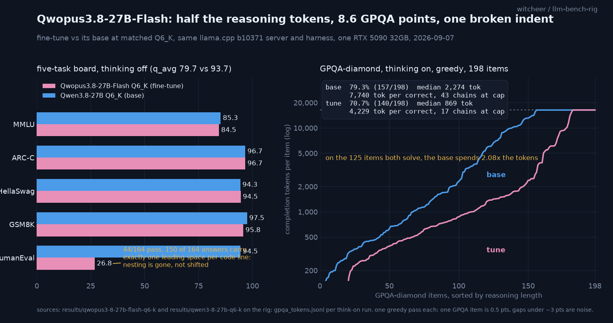

# Qwopus3.8-27B-Flash vs its base on one RTX 5090: half the reasoning tokens, 8.6 GPQA points, one broken indent

**TL;DR.** Qwopus3.8-27B-Flash (Jackrong's fine-tune of Qwen3.8-27B, Q6_K, 22.4 GB) was measured against the banked Qwen3.8-27B Q6_K on the same llama.cpp build, same harness, same card, same day. Three findings. (1) The "more efficient reasoning" claim is real and about **2x**, not 10x: on GPQA-diamond with thinking on, the tune spends 4,229 completion tokens per correct answer against the base's 7,740, and on the 125 items both solve the base uses 2.08x the tokens. It pays for that with **8.6 GPQA points** (70.7 vs 79.3). (2) The card's speculative-decode claim (+12.8% decode, 80.7% vs 66.1% acceptance) **does not reproduce** think-off: both models run 61 to 62 tok/s plain and 109 to 145 tok/s with the MTP head at n=2, weighted acceptance 0.762 vs 0.768. (3) HumanEval falls from 94.5 to **26.8** because the tune emits exactly one leading space on every code line in 150 of 164 answers. Nesting depth is destroyed in the output, not shifted, so no whitespace repair recovers it (48/164 with the most generous fix). The card discloses this as a known issue; this is the number.

## Setup

- **Hardware:** RTX 5090 32GB (sm_120), single card, single stream.
- **Subject:** `Jackrong/Qwopus3.8-27B-Flash-GGUF`, file `Qwopus3.8-27B-Flash-MTP-Q6_K.gguf`, 22,430,995,552 bytes (size verified against the HF API), sha256 `2f405464...`, embedded MTP drafter head. Card fetched 2026-09-07.
- **Reference:** the banked `Qwen3.8-27B-Q6_K.gguf` (unsloth, 21.3 GiB) from the [quant ladder](qwen3-8-27b-quant-ladder.md). Board row unchanged; the think-on GPQA leg was **re-run the same day** for a paired comparison and reproduced the 2026-08-19 run to the item (198/198 identical predictions, greedy).
- **Server:** llama.cpp `b10371-5d16e81dd`, `--n-gpu-layers 99 --jinja`, fully VRAM-resident. Provenance block (server command, `/props`, chat-template hash, gguf sha, harness sha) in `results/qwopus3-8-27b-flash-q6-k/meta.json`.
- **Quality:** the standing five-task board (MMLU/HellaSwag 50% stratified sample seed 42, ARC-C/GSM8K/HumanEval full), greedy, **thinking off**. GPQA-diamond (198 items, zero-shot, deterministic option shuffle, greedy) in both regimes; think-on at `max_tokens 16384, ctx 24576` with a per-item token sidecar (`gpqa_tokens.jsonl`).
- **Speed:** llama-bench pp512/tg128 with the depth sweep; plus the served (HTTP) lane: 8 prompts x 4 workloads (prose/code/repetitive/chat), 256 tokens, temperature 0, `--spec-type none` vs `draft-mtp` n=2, run for the tune and for the base on identical server flags, back to back.
- Run window 2026-09-07 06:20 to 16:20 UTC, six legs, all rc=0, one script (`~/qwopus38-treatment.sh`, night-lib rails).

## Speed

llama-bench (tune): pp512 **3,148** tok/s, tg128 **62.96**, tg128 @ d8192 60.41, @ d32768 58.05. The base Q6_K row reads tg128 63.08 and pp512 3,223. Same file size class, same speed; there is nothing architectural here to move.

Served lane, p50 decode tok/s over 8 prompts per cell, think off:

| workload | base, plain | base, MTP n=2 | tune, plain | tune, MTP n=2 |
|---|---:|---:|---:|---:|
| prose | 61.3 | 108.6 (acc 0.604) | 61.9 | 110.4 (acc 0.617) |
| code | 61.4 | 138.8 (acc 0.933) | 61.9 | 136.1 (acc 0.901) |
| repetitive | 61.3 | 143.5 (acc 0.987) | 61.8 | 144.5 (acc 0.972) |
| chat | 61.2 | 112.6 (acc 0.673) | 61.8 | 115.5 (acc 0.677) |

`acc` is draft acceptance from llama-server's per-request `timings` (`draft_n_accepted / draft_n`, summed per cell). Weighted over all 32 prompts: **0.762 tune vs 0.768 base**. The card's "80.7% vs 66.1% acceptance, +12.8% decode" figure came from think-on MMLU-Pro chains at Q5_K_M, a different regime and a different quant; on think-off short outputs at Q6_K the two heads are indistinguishable. The "~100 tok/s on a 5090 with MTP" line is consistent with what both models do here (109 to 145 depending on how predictable the text is), so that claim holds, just not as a difference from the base.

## Quality, thinking off

| task | Qwopus3.8-27B-Flash Q6_K | Qwen3.8-27B Q6_K | delta |
|---|---:|---:|---:|
| MMLU | 84.47 | 85.28 | -0.8 |
| ARC-Challenge | 96.67 | 96.67 | 0.0 |
| HellaSwag | 94.52 | 94.34 | +0.2 |
| GSM8K | 95.75 | 97.50 | -1.8 |
| HumanEval | **26.83** | 94.51 | **-67.7** |
| **q_avg** | **79.65** | **93.66** | -14.0 |
| GPQA-diamond (think-off) | 51.01 (0 unparsed) | 48.99 | +2.0, noise |

Four of five tasks sit within the board's error band (median q_avg half-width ~1 point, see `board_ci.csv`); GSM8K's -1.8 is at the edge of it. The q_avg gap is HumanEval alone.

### The HumanEval indentation autopsy

The standard grader passes 44/164. All 50 logged errors are `IndentationError: expected an indented block after 'for'/'if'/'def'/'while'`. Raw responses were regenerated for both models on the same harness path (`humaneval_raw.jsonl`) and graded three ways:

| grading | tune | base |
|---|---:|---:|
| standard (harness) | 44/164 | 155/164 |
| compiles at all | 47/164 | 163/164 |
| whitespace repair, iterated | 48/164 | 155/164 |

The repair bumps any block that sits at or below its `:` line by four spaces and iterates. It recovers four problems. The reason it cannot recover more: the tune emits **exactly one leading space on every code line** in 150 of 164 outputs (base: 41, and those are single-level bodies that need no nesting). A `for` body and the statement after the loop arrive at the same column, so the depth information is gone from the output rather than shifted; a whitespace-only fix has nothing to work from. Both GGUFs carry an identical vocabulary (248,320 tokens, 0 differences, the 4- and 8-space tokens present), so this is the fine-tune's learned formatting, not a tokenizer or quant artefact. It is consistent with training data whose indentation was collapsed.

The card lists "incorrect Python indentation, fix in progress" as a known issue and reports 13/14 on an agentic SWE battery. Those two are compatible: a multi-turn agent loop with test feedback would see the `IndentationError` and retry, which is exactly the path a one-shot benchmark does not have. What this measurement says is that one-shot Python from this checkpoint is about 29% at best (48/164), and that a base-vs-tune comparison of code *logic* is not possible from these outputs, so no claim is made about the logic underneath.

## GPQA-diamond, thinking on

Identical recipe for both: `max_tokens 16384, ctx 24576`, zero-shot, greedy, one pass, per-item token sidecar. Paired same day on the same server build.

| | Qwopus3.8-27B-Flash Q6_K | Qwen3.8-27B Q6_K |
|---|---:|---:|
| accuracy | **70.71** (140/198) | **79.29** (157/198) |
| unparsed | 12 | 14 |
| chains at the 16k cap | 17 (1 scored correct) | 43 (8 scored correct) |
| completion tokens, total | 592,040 | 1,215,233 |
| median tokens per item | 869 | 2,275 |
| p90 tokens per item | 11,570 | 16,384 (cap) |
| **tokens per correct answer** | **4,229** | **7,740** |
| wall time | 2.66 h | 5.53 h |
| accuracy on chains that finished under the cap | 76.8 (181 items) | 96.1 (155 items) |

Item overlap: both correct 125, tune only 15, base only 32. On the 125 items both solve, the base spends **2.08x** the tokens (median 1,032 vs 671).

Reads:

1. **The efficiency claim is real, and the honest multiplier is 2x.** Total tokens halve, tokens per correct answer nearly halve, wall time halves. The card's "up to 10x" is a different measurement (their xhigh budget, their MMLU-Pro subset) and is not what a matched greedy GPQA run shows.
2. **It is bought with accuracy.** 8.6 points on this set is outside the ~3 point noise band. The shape of the loss is visible in the sidecar: the base pushes 43 chains to the cap and is right 96% of the time when it does finish; the tune stops early far more often (146 of 198 chains under 2,048 tokens vs 96 for the base) and is right 77% of the time when it finishes. The tune has learnt to stop; it has not learnt to stop at the right moment as often.
3. **Their own card agrees on direction.** It reports -1.45 pp MMLU-Pro against the base; GPQA-diamond under a fixed greedy budget shows the same trade at a larger size.

## Worth it?

**Worth it if** your workload is chat-shaped thinking where latency and token spend matter more than the last ten points on a hard set, and you are not asking for one-shot Python: at 2.66 h against 5.53 h for the same 198 questions the wall-time saving is the whole story, and the four non-code board tasks are level with the base. **Not worth it if** you write code with it outside an agent loop that runs the code (the indentation issue is a hard floor until the author's fix ships), or if you need the base's reasoning ceiling. The MTP head is not a reason to pick it either way: same speed class, same acceptance as the base's own head.

## Honest limits

- One quant (Q6_K), one greedy pass per cell. GPQA-diamond is 198 items: one item is 0.5 points, and the base's 8.6 point edge is real but the token multiplier should be read as "about 2x", not to the second decimal.
- Think-on runs use a fixed 16,384 budget; both models leave chains at the cap (17 and 43). A larger budget would raise the base more than the tune and widen both the accuracy gap and the token ratio.
- The card's spec-decode numbers were measured think-on at Q5_K_M; the served lane here is think-off at Q6_K, so "does not reproduce" means "not under these conditions", stated as such.
- The HumanEval logic comparison is not possible from these outputs (see autopsy). No claim is made about it.
- Base speed rows are the banked 2026-08-15 llama-bench numbers on b9653; the tune's are on b10371. Both are fully resident and the two builds are within 0.2 tok/s on tg128 for this model class, but they are not a same-build pair. The served lane IS same-build, same-day, and is the comparison that carries the spec-decode finding.
