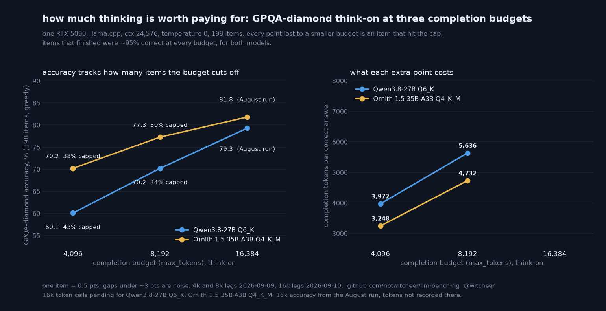

# How much thinking is worth paying for: GPQA-diamond think-on at three completion budgets on one RTX 5090

**TL;DR.** Two think-on models, the same 198 GPQA-diamond items, the same server, and only the completion budget (`max_tokens`) moved: 4,096, 8,192, 16,384. Qwen3.8-27B Q6_K scores **60.1 / 70.2 / 79.3**, Ornith 1.5 35B-A3B Q4_K_M **70.2 / 77.3 / 81.8**. Every point lost at a smaller budget is an item that ran into the cap: in all four new legs, 100% of the items that were correct at 16k and wrong at 4k or 8k are items the budget truncated (Qwen 42/42 and 23/23, Ornith 25/25 and 11/11), and no uncapped item got worse. Items that finished inside the budget were correct 94.7 to 95.4% of the time at every budget, for both models. The median item thinks for roughly 950 tokens, but 30 to 43% of the set runs past 4k or 8k, and that tail is where the hard questions live. Cost: going from 4k to 8k buys Qwen +10.1 points for +66% completion tokens (3,972 to 5,636 tokens per correct answer), Ornith +7.1 points for +46% (3,248 to 4,733). Ornith is the cheaper thinker at every budget measured, by 700 to 900 tokens per correct answer.

## Why this study

The local-inference frustrations harvest of 2026-09-08 (222 replies to one X thread) kept returning to reasoning models on consumer cards: "27B blows the budget on reasoning", doom loops, models that "don't finish their tasks". The published fix is usually "raise max_tokens", which is a memory and latency cost with no number attached. This report attaches the number: for two models this box runs, what does each doubling of the completion budget buy in accuracy, and what does it cost in tokens per correct answer? Tokens per correct is now a standing output of the think-on GPQA eval in this repo (`lib/evals/gpqa.py`, since ee3e1c8), so every future think-on leg carries it.

## Setup

- **Hardware and server:** RTX 5090 32 GB, llama.cpp llama-server started through `lib.quality.start_llama_server` (the harness's standard line), `ctx_size 24576`, the resident server drained for the duration and restored after. Models fully resident.
- **Models:** `Qwen3.8-27B-Q6_K.gguf` (dense, thinking on); `Ornith-1.5-35B-Q4_K_M.gguf` (35B-A3B MoE, thinking on). Both were already on the board with think-on 16k legs from August (`results/<slug>-thinkon/gpqa.json`).
- **Eval:** GPQA-diamond, 198 items, zero-shot, deterministic per-item option shuffle (seed `42-<idx>`), temperature 0, `think=True`, letter extraction with the reasoning-block fallback used by every think-on leg in this repo. The only variable across legs is `max_tokens` (4,096 / 8,192 / 16,384). `capped` means the completion reached `max_tokens`.
- **Runs:** 4k and 8k legs 2026-09-09 15:25 to 22:16 CEST in one script (`budget-curve.sh`, night-lib rails, exact-slug artefacts `results/<slug>-thinkon/budget-<N>/`), Qwen then Ornith. 16k token legs 2026-09-10 from 07:07 CEST (same script, budget 16384; the August 16k legs recorded accuracy only). Per-item sidecar `gpqa_tokens.jsonl` (`idx, completion_tokens, correct, capped`).
- **Noise band:** one item is 0.5 points; gaps under about 3 points between two legs are within the 198-item band. The differences reported here are 7 to 19 points.

## Results

| model | budget | accuracy | capped items | unparsed | median completion tokens | tokens per correct | completion tokens, total |
|---|---:|---:|---:|---:|---:|---:|---:|
| Qwen3.8-27B Q6_K | 4,096 | **60.1** (119/198) | 85 (43%) | 46 | 2,274 | 3,972 | 472,692 |
| Qwen3.8-27B Q6_K | 8,192 | **70.2** (139/198) | 68 (34%) | 31 | 2,274 | 5,636 | 783,365 |
| Qwen3.8-27B Q6_K | 16,384 | **79.3** (157/198) | not recorded | 14 | not recorded | pending (leg running 2026-09-10) | pending |
| Ornith 1.5 35B-A3B Q4_K_M | 4,096 | **70.2** (139/198) | 75 (38%) | 30 | 2,096 | 3,248 | 451,533 |
| Ornith 1.5 35B-A3B Q4_K_M | 8,192 | **77.3** (153/198) | 60 (30%) | 19 | 2,096 | 4,732 | 724,068 |
| Ornith 1.5 35B-A3B Q4_K_M | 16,384 | **81.8** (162/198) | not recorded | 14 | not recorded | pending (leg running 2026-09-10) | pending |

The median completion length is identical across the 4k and 8k legs of the same model (2,274 and 2,096 tokens) because greedy decoding produces the same text until the cap; only the tail changes.

### Where the points go: capped vs finished, and the per-item diff against 16k

| model | budget | finished items | correct among finished | capped items | correct among capped | correct at 16k, wrong here | ...of which capped here | wrong at 16k, correct here |
|---|---:|---:|---:|---:|---:|---:|---:|---:|
| Qwen3.8-27B Q6_K | 4,096 | 113 | 107 (94.7%) | 85 | 12 (14.1%) | 42 | 42 | 4 |
| Qwen3.8-27B Q6_K | 8,192 | 130 | 124 (95.4%) | 68 | 15 (22.1%) | 23 | 23 | 5 |
| Ornith 1.5 35B-A3B Q4_K_M | 4,096 | 123 | 117 (95.1%) | 75 | 22 (29.3%) | 25 | 25 | 2 |
| Ornith 1.5 35B-A3B Q4_K_M | 8,192 | 138 | 131 (94.9%) | 60 | 22 (36.7%) | 11 | 11 | 2 |

The "correct among capped" column is not zero because the answer letter sometimes appears in the reasoning before the cap and the fallback extractor picks it up; it is 14 to 37%, close to what guessing plus a partial chain would give, against ~95% for finished items.

## Reads

1. **Accuracy is a function of how many items the budget cuts off, nothing else.** Across the four new legs, every item lost against the 16k reference was capped (101 of 101), and finished items scored 94.7 to 95.4% regardless of budget or model. A smaller budget does not make the model worse at the items it can finish; it removes the items it cannot.
2. **The tail is fat and the tail is the hard part.** Finished items have a median of ~950 tokens and a 75th percentile of ~2.1k, yet 43% (Qwen) and 38% (Ornith) of the set runs past 4,096 tokens, and 34% / 30% past 8,192. The questions that need the room are disproportionately the ones the model gets right when given it.
3. **The price of a point rises with the budget.** 4k to 8k: Qwen pays +66% completion tokens for +10.1 points, Ornith +46% for +7.1. The 8k to 16k step (tokens pending, accuracy known) buys +9.1 and +4.5 points. Tokens per correct at 16k is the number that closes the curve; the legs are running as this report is written and the table will be updated in place.
4. **Ornith thinks cheaper.** At every budget it caps fewer items (38 vs 43%, 30 vs 34%) and spends 700 to 900 fewer tokens per correct answer, and its 3B-active MoE decodes 4.6 times faster than the dense 27B on this card without a draft head (289 vs 63 tok/s on the same server line, `reports/recipes/`), so the wall-clock gap per correct answer is far larger than the token gap. This is a comparison of two quants of two different models, not a quant ladder; it says what a buyer of either gets, not why.
5. **For an agent harness, the actionable setting is the cap, not the model.** With 30% of hard items still capped at 8k on both models, `max_tokens` below 16k on a reasoning model turns a 79 to 82% model into a 60 to 77% one on exactly the questions that motivated reasoning in the first place. If the memory for a 16k+ completion window is not there (the f16 KV cache at 32k context on Qwen3.8-27B is about 1.8 GiB on this build, from the recipe sweep's q8 saving of 0.9 GiB), a smaller model with the full budget is the better trade than a bigger model with a truncated one.

## Honest limits

- Two models, one quant each, one hardware/server stack. The shape (losses = capped items) is likely general for greedy think-on evaluation; the slopes are these two models' own.
- Greedy decoding, single run. The 198-item band is stated above; the August 16k legs were separate runs on the same build, so the 16k legs of 2026-09-10 also serve as a same-regime repeat.
- The 16k tokens-per-correct cells are pending at the time of writing; the table marks them and this file is updated when they land.
- GPQA-diamond is a multiple-choice science set; "tokens per correct" on an agentic task would need the agentic evals in this repo, which do not run think-on yet.

## Files

- `results/qwen3-8-27b-q6-k-thinkon/budget-{4096,8192,16384}/` and `results/ornith-35b-thinkon/budget-{4096,8192,16384}/`: `gpqa.json`, `gpqa_progress.json`, `gpqa_tokens.jsonl`.
- `results/<slug>-thinkon/gpqa.json`: the August 16k accuracy legs.
- Chart script: `scripts/chart_budget_curve.py` (reads the mirror of the results tree).
