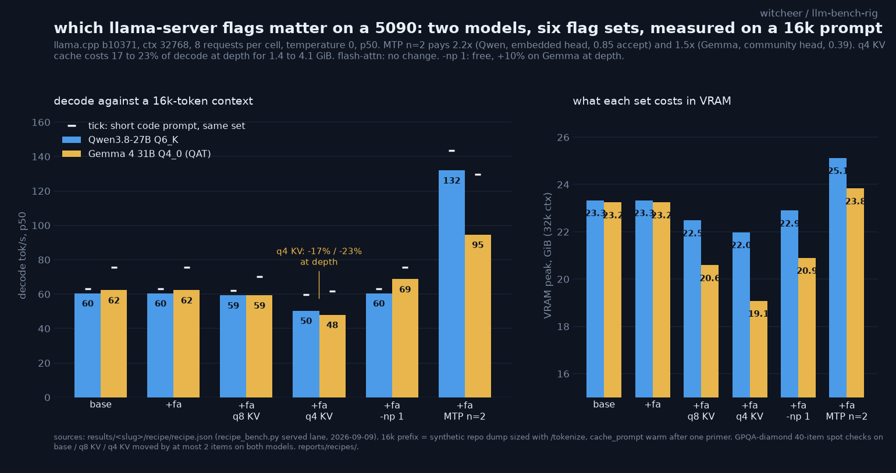

# Recipe: Qwen3.8-27B Q6_K on one RTX 5090

**The line:**

```
llama-server -m Qwen3.8-27B-Q6_K.gguf --jinja -ngl 99 -c 32768 -fa on -np 1 \
  --spec-type draft-mtp --spec-draft-n-max 2
```

144 tok/s on code, 111 on prose, 132 decoding against a 16k-token context, 25.1 GiB at 32k ctx. The MTP head is embedded in unsloth's GGUF (the `nextn` tensors), so no second file. Drop `-fa on` and nothing changes on this card; drop the MTP flags and you are at 63 tok/s. Keep the KV cache at f16.



## The six sets

| flag set | code tok/s | prose tok/s | 16k cold TTFT | 16k warm TTFT | tok/s on 16k prefix | VRAM peak | GPQA 40-item | MTP accept |
|---|---:|---:|---:|---:|---:|---:|---:|---:|
| base (`--jinja -ngl 99 -c 32768`) | 63.1 | 63.1 | 5.47 s | 0.117 s | 60.5 | 23.3 GiB | 19/40 |  |
| + `--flash-attn on` | 63.0 | 62.9 | 5.49 s | 0.116 s | 60.5 | 23.3 GiB |  |  |
| + fa + KV `q8_0/q8_0` | 62.0 | 61.9 | 5.52 s | 0.118 s | 59.3 | 22.5 GiB | 17/40 |  |
| + fa + KV `q4_0/q4_0` | 59.6 | 59.6 | 5.51 s | 0.119 s | 50.4 | 22.0 GiB | 21/40 |  |
| + fa + `--parallel 1` | 63.0 | 63.0 | 5.50 s | 0.116 s | 60.5 | 22.9 GiB |  |  |
| + fa + MTP `--spec-type draft-mtp --spec-draft-n-max 2` | 143.6 | 111.3 | 5.77 s | 0.158 s | 132.0 | 25.1 GiB |  | 0.93 code / 0.61 prose |

## Reads

1. **MTP is the whole recipe.** The embedded draft head pays 1.8x on prose, 2.3x on code and repetitive text, and 2.2x against a 16k prefix, at 0.61 to 0.99 acceptance. It costs 1.8 GiB and 10 ms of TTFT. Same head, same ratios as the deployed Qwen3.6-27B in the spec-cache study; this is the second model on this rig where MTP n=2 is simply the right default.
2. **Flash attention and `--parallel 1` are free and change nothing measurable.** 63.0 vs 63.1 tok/s, 22.9 vs 23.3 GiB. Keep them on for hygiene, expect nothing.
3. **q8_0 KV is a memory tool, q4_0 KV is a speed tax.** q8 costs 1 tok/s and saves 0.9 GiB at 32k ctx. q4 saves 1.4 GiB and costs 3.5 tok/s on short prompts but **10 tok/s against a 16k prefix** (50.4 vs 60.5, a 17% cut), because the dequant sits on the attention path and the deeper the context the more of it there is. The 40-item spot checks (19, 17, 21 of 40) are inside noise on both, so this is not a quality question on this model, it is a speed one. If you need the 1.4 GiB, take a smaller quant of the weights instead.
4. **Prefill for 16k tokens is 5.5 s cold and 0.12 s warm.** The derived estimate in the board's speed-at-depth table (16384 / pp512@8k = 5.3 s) is confirmed to within 4%. Prompt caching is what makes a 27B on one card usable as a coding agent: the first turn pays 5.5 s, every later turn pays nothing.

## Worth knowing

- 32k context at f16 KV fits with 8.7 GiB to spare; 64k would need q8 KV or a 24 GiB budget for weights + cache.
- On a 24 GB card the same line runs at `-c 16384`; the MTP head's 1.8 GiB is the first thing to keep, the context the first thing to cut.
- One model, one quant, one build, one pass per cell; the GPQA spot check is 40 items, a screen, not a score.

## Method

One `llama-server` per flag set (llama.cpp b10371, the build the board's resident rows use), `--jinja -ngl 99 --ctx-size 32768 --host 127.0.0.1`, plus the set's flags. Measured with `scripts/recipe_bench.py`, the rig's served lane: the four short workloads (prose, code, repetitive, chat; 8 prompts each, 256 tokens, temperature 0, one discarded warm-up) and a **long lane** with a synthetic repository dump as system prompt, sized to exactly 16,384 tokens with the server's `/tokenize`, followed by 8 short coding questions. The long lane runs twice: **cold** (`cache_prompt: false`, the whole prompt is prefilled on every request, the first turn of an agent session) and **warm** (`cache_prompt: true` after one primer, only the question is prefilled, every later turn). p50 over 8 requests per cell; TTFT is the time to the first content chunk as the client sees it, tok/s is `completion_tokens / (total_s - ttft_s)`. VRAM peak sampled at 0.5 Hz across serve + bench. The 40-item GPQA-diamond spot check (think-off, greedy, the standing harness) runs on the base set and on both KV-quantised sets, in a separate pass with identical flags; at n=40 one item is 2.5 points, so only moves of 3 or more items are read as signal. Server `/props` confirmed 4 slots at n_ctx 32768 on every set (unified KV, so `--parallel 1` changes the cache layout, not the per-slot window). Run 2026-09-09 08:33 to 09:45 CEST, `recipe-sweep.sh` + `recipe-gpqa-spot.sh`, raw records `results/<slug>/recipe/<set>.jsonl`.
