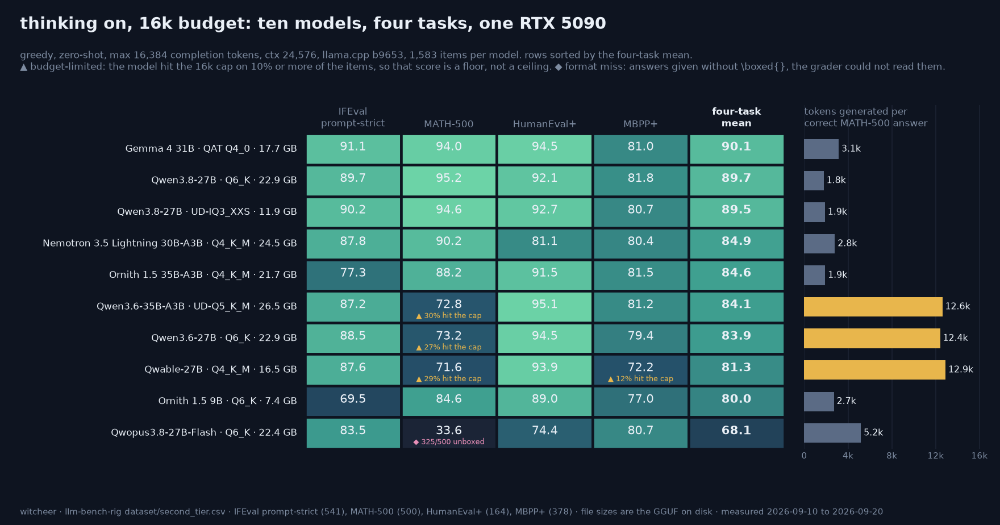

# Thinking on at a 16k budget: ten models, four tasks, one RTX 5090

**Rig:** RTX 5090 32GB (capsule), llama.cpp build 10371 (`5d16e81dd`), llama-server (corrected 2026-09-27: first published as b9653 `9dbc6621a`; the rig's `server_bin` has pointed at the `5d16e81dd` build since 2026-08-11), batch 1 · **Window:** 2026-09-10 to 2026-09-20, inside the box's cheap-electricity hours · **Harness:** [llm-bench-rig](https://github.com/notwitcheer/llm-bench-rig) second-tier lane, `scripts/` night and idle-queue items, artefacts in `results/<slug>-thinkon/` · **Data:** [`dataset/second_tier.csv`](../dataset/second_tier.csv) · **Chart:** [`second-tier-thinkon-16k.png`](second-tier-thinkon-16k.png)

## TL;DR

1. **Three models tie at the top, and one of them is an 11.9 GB file.** Gemma 4 31B QAT Q4_0 averages 90.1 over IFEval, MATH-500, HumanEval+ and MBPP+; Qwen3.8-27B Q6_K 89.7; Qwen3.8-27B UD-IQ3_XXS 89.5. The Wilson 95% half-width on a four-task mean here is 1.6 points, so the 0.6 spread is a tie. The 3-bit Qwen3.8 cut is within 1.1 points of its 6-bit sibling on every one of the four tasks (IFEval +0.55, MATH-500 -0.6, HumanEval+ +0.61, MBPP+ -1.06) at 52% of the file size.
2. **The maths column is a budget column for three rows.** Qwen3.6-27B Q6_K (73.2), Qwen3.6-35B-A3B UD-Q5_K_M (72.8) and Qwable-27B Q4_K_M (71.6) hit the 16,384-token completion cap on 27%, 30% and 29% of the 500 problems, and spent 12.4k to 12.9k completion tokens per correct answer against 1.8k to 1.9k for the two Qwen3.8 rows. Those three scores are floors at 16k, not ceilings; a separate 32k pass on exactly those legs is queued.
3. **One format miss, not a maths result.** Qwopus3.8-27B-Flash Q6_K reads 33.6 on MATH-500 with 325 of 500 answers delivered without the `\boxed{}` the grader looks for and only 3.8% capped; on the other three tasks it sits with the pack (IFEval 83.6, HumanEval+ 74.4, MBPP+ 80.7).

## Setup

- **Regime, every row:** thinking on, `max_tokens 16384`, `ctx 24576`, greedy (`temperature 0`), zero-shot, batch 1 through llama-server's chat-completions endpoint. One pass per item, no retries on a wrong answer; an item cut by the block's hard stop was re-run from scratch at the next block (the tokens sidecars keep both lines).
- **Tasks:** IFEval (541 prompts, prompt-strict accuracy; inst-strict is in the detail json), MATH-500 (500, answer equivalence via the vendored Qwen-Math grader), HumanEval+ (164, pass@1) and MBPP+ (378, pass@1), the EvalPlus extended test sets for the code pairs. 1,583 items per model, 15,830 graded generations in total.
- **Rows (GGUF on disk, bytes from `stat -L`):** Gemma 4 31B-it QAT Q4_0 17,650,999,456 · Qwen3.8-27B Q6_K 22,884,408,288 · Qwen3.8-27B UD-IQ3_XXS 11,913,559,104 · Nemotron 3.5 Lightning 30B-A3B Q4_K_M 24,515,129,280 · Ornith 1.5 35B-A3B Q4_K_M 21,713,462,848 · Qwen3.6-35B-A3B UD-Q5_K_M 26,456,194,016 · Qwen3.6-27B Q6_K 22,884,406,400 · Qwable-27B Q4_K_M 16,547,398,976 · Ornith 1.5 9B Q6_K 7,359,259,392 · Qwopus3.8-27B-Flash Q6_K 22,430,995,552 (Jackrong's fine-tune of Qwen3.8-27B, embedded MTP head, run without speculation here).
- **Cap and cost bookkeeping:** `capped_count` is the number of items whose completion reached the budget; `tokens_per_correct` is total completion tokens on the task divided by correct items; both come from each task's `*_tokens.jsonl` sidecar via `token_summary`. Five legs produced before that field existed (Qwen3.6-35B-A3B IFEval, HumanEval+, MBPP+; Qwen3.8-27B Q6_K IFEval, HumanEval+) had `tokens_per_correct` derived from the same sidecar by hand, same formula.

## The board

Scores are percentages. `cap` is the share of items that hit the 16k completion budget. `unboxed` is MATH-500 answers the grader could not extract.

| Model | Quant | GGUF | IFEval | MATH-500 | HumanEval+ | MBPP+ | Mean | MATH-500 cap | MATH-500 unboxed | MATH-500 tokens / correct |
|---|---|---:|---:|---:|---:|---:|---:|---:|---:|---:|
| Gemma 4 31B-it | QAT Q4_0 | 17.7 GB | 91.1 | 94.0 | 94.5 | 81.0 | **90.1** | 2.2% | 11 | 3,143 |
| Qwen3.8-27B | Q6_K | 22.9 GB | 89.7 | 95.2 | 92.1 | 81.8 | **89.7** | 1.6% | 4 | 1,780 |
| Qwen3.8-27B | UD-IQ3_XXS | 11.9 GB | 90.2 | 94.6 | 92.7 | 80.7 | **89.5** | 1.2% | 2 | 1,891 |
| Nemotron 3.5 Lightning 30B-A3B | Q4_K_M | 24.5 GB | 87.8 | 90.2 | 81.1 | 80.4 | **84.9** | 6.2% | 31 | 2,799 |
| Ornith 1.5 35B-A3B | Q4_K_M | 21.7 GB | 77.3 | 88.2 | 91.5 | 81.5 | **84.6** | 2.2% | 6 | 1,909 |
| Qwen3.6-35B-A3B | UD-Q5_K_M | 26.5 GB | 87.2 | 72.8 ▲ | 95.1 | 81.2 | **84.1** | 30.2% | 122 | 12,610 |
| Qwen3.6-27B | Q6_K | 22.9 GB | 88.5 | 73.2 ▲ | 94.5 | 79.4 | **83.9** | 27.0% | 114 | 12,406 |
| Qwable-27B | Q4_K_M | 16.5 GB | 87.6 | 71.6 ▲ | 93.9 | 72.2 ▲ | **81.3** | 28.8% | 127 | 12,895 |
| Ornith 1.5 9B | Q6_K | 7.4 GB | 69.5 | 84.6 | 89.0 | 77.0 | **80.0** | 5.8% | 27 | 2,712 |
| Qwopus3.8-27B-Flash | Q6_K | 22.4 GB | 83.6 | 33.6 ◆ | 74.4 | 80.7 | **68.1** | 3.8% | 325 | 5,177 |

▲ budget-limited: 10% or more of the items hit the cap (Qwable-27B MBPP+ capped 12.2%). ◆ format miss: 325 of 500 answers unboxed. Per-task `correct`/`total`, `capped_count`, `parse_failures`, `tokens_per_correct` and the median completion length are in [`dataset/second_tier.csv`](../dataset/second_tier.csv).

Wilson 95% half-widths per task run 1.9 to 6.6 points on these set sizes (HumanEval+ at 164 items is the widest); the propagated half-width on a four-task mean is 1.6 to 2.3 points per row. Differences under two points on the mean column are not rankings.

## Reads

1. **File size did not decide the order.** The smallest file that finished its thinking, Qwen3.8-27B UD-IQ3_XXS, ties the two 17 to 23 GB leaders; the 26.5 GB Qwen3.6-35B-A3B sits sixth. What separated the top three from the middle was finishing inside the budget, and on the code and instruction columns the middle is close to the top anyway (Qwen3.6-35B-A3B has the best HumanEval+ on the board at 95.1).
2. **The 27 to 30% cap rows are one family of behaviour.** All three capped rows carry a median completion of 8,100 to 8,650 tokens on MATH-500 against 550 to 1,640 for the low-cap rows, and their unboxed counts (114 to 127) move with their capped counts (135 to 151): the answer never arrived, rather than arriving in the wrong shape. A 16k budget is too small for how these models reason on competition maths; the same models cap under 6% on IFEval and under 8% on HumanEval+.
3. **Qwable-27B also pays on MBPP+.** 12.2% capped, 72.2 pass@1, 5,754 tokens per correct answer against 1,400 to 2,300 for the leaders. It is the only row with two flagged cells.
4. **IFEval is where the MoE and small rows separate.** Ornith 1.5 35B-A3B posts 91.5 on HumanEval+ but 77.3 on IFEval; Ornith 1.5 9B 89.0 and 69.5. Both are at 1.7% and 5.9% capped, so this is not a budget effect.
5. **Nemotron 3.5 Lightning is the second most expensive row on IFEval** (4,062 tokens per correct, behind Qwable-27B's 4,137) and spends 2,799 on MATH-500 for 90.2, with 31 unboxed at 6.2% capped.
6. **The Qwopus3.8-27B-Flash maths cell is a format miss.** 325 unboxed at 3.8% capped and a 552-token median means the answers were short and plain, without the `\boxed{}` wrapper. It is a formatting failure of the same kind as this model's HumanEval collapse on the main board (footnote 15 there: a leading-space indentation issue the model card discloses). The HumanEval+ 74.4 here is thinking on with a 16k budget, a different regime from the main board's 26.8, so the two are not a pair. A tolerant extractor (last-line fallback) and an offline regrade would settle what the maths score is; that is a harness change, not a GPU run, and it is on the owed list.

## Worth it if / not if

- **Worth it if** you run a 16 GB card and want thinking on: Qwen3.8-27B UD-IQ3_XXS (11.9 GB file, 12.8 GiB peak at a 16k prompt in `dataset/card_fit.csv`) ties the top of this table.
- **Worth it if** you want the most instruction-faithful row at any size in the set: Gemma 4 31B QAT Q4_0, 91.1 prompt-strict, 95.6 inst-strict.
- **Not if** you plan to run Qwen3.6-27B, Qwen3.6-35B-A3B or Qwable-27B on competition maths with a 16k cap. Give them 32k or read their maths column as a floor.
- **Not if** you need a maths verdict on Qwopus3.8-27B-Flash from this table; the cell measures answer formatting.

## Honest limits

- One greedy pass per item, one build, one card. No repeats, so the intervals above are sampling intervals, not run-to-run variance.
- Rows were produced across ten days and two script shapes (night scripts on 2026-09-10/11, then the heures-creuses idle-queue item). Regime, build and harness were held constant; the cap and the resume-from-hard-stop logic are identical in both.
- MATH-500 rows graded before 2026-09-14 were regraded in place on that date after the vendored Qwen-Math grader's import was found to fall back to string equality on Python 3.13 (`latex2sympy2` antlr runtime); the `regraded` column in the csv names them. Rows produced afterwards ran with the fixed grader (`grade(r'\frac{1}{2}', '0.5')` prints `True` in the run venv, checked 2026-09-20).
- The `tokens_per_correct` for five legacy legs was derived from the sidecar by the same formula the harness uses; noted in Setup.
- Think-on scores are not comparable to the think-off board in `dataset/README.md`, and IFEval prompt-strict is a stricter metric than the inst-strict number most model cards quote.
- Nothing here measures speed. The served numbers for these files are in `dataset/benchmarks.csv` and `reports/recipes/`.

## Owed

- ~~The 32k pass on the three capped MATH-500 legs~~ published 2026-09-27 as its own table: [thinking on at a 32k budget](second-tier-thinkon-32k.md).
- Tolerant-extractor regrade for the Qwopus3.8-27B-Flash MATH-500 cell.
- The think-off second-tier pass (class-default budgets, ctx 8192) for the think-on vs think-off delta.

*Sources: `results/<slug>-thinkon/{ifeval,math500,humaneval_plus,mbpp_plus}_detail.json` and `*_tokens.jsonl` on the rig, 2026-09-20; `dataset/second_tier.csv` in this commit; harness commits 1696f04 (token summary), 83ff9ca (grader fallback + regrade script), c1aa412 (per-item server-error resilience).*
