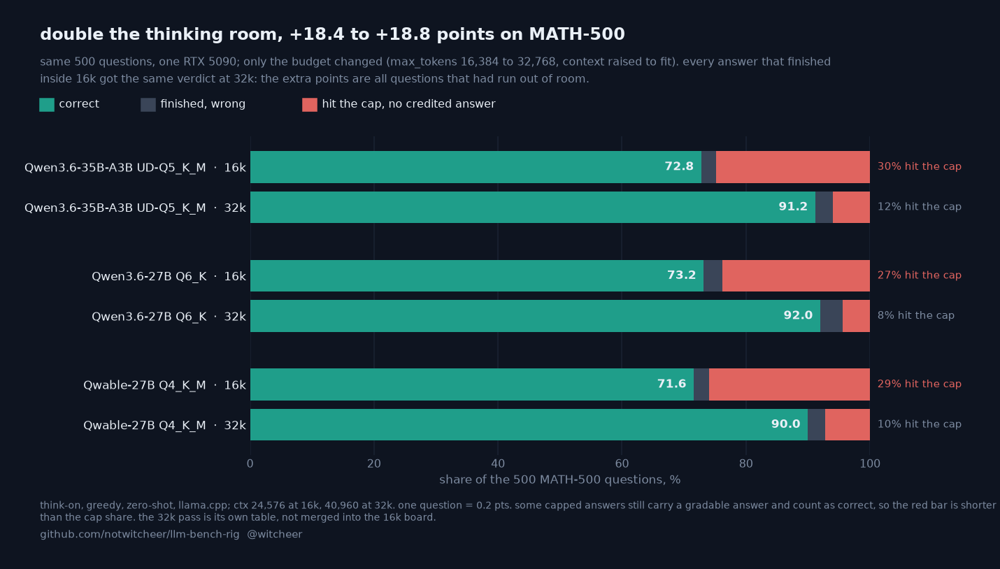

# Thinking on at a 32k budget: the three MATH-500 rows that capped at 16k

**Rig:** RTX 5090 32GB (capsule), llama.cpp build 10371 (`5d16e81dd`), llama-server, batch 1 · **Window:** 2026-09-20 to 2026-09-27, inside the box's cheap-electricity hours · **Harness:** [llm-bench-rig](https://github.com/notwitcheer/llm-bench-rig) second-tier lane, idle-queue item `15-second-tier-thinkon-32k`, artefacts in `results/<slug>-thinkon-32k/` · **Data:** [`dataset/second_tier_32k.csv`](../dataset/second_tier_32k.csv) · **Chart:** [`second-tier-thinkon-32k.png`](second-tier-thinkon-32k.png) · **Parent:** [thinking on at a 16k budget](second-tier-thinkon-16k.md)

This is a separate bench, not a rerun merged into the 16k board. The 16k board flagged three MATH-500 cells as budget floors (▲): the rows hit the 16,384-token completion cap on 27 to 30% of the 500 problems. This pass gives exactly those three rows 32,768 tokens and changes nothing else that affects the answers.

## TL;DR

1. **Doubling the budget moved the three rows from 71.6 to 73.2 up to 90.0 to 92.0.** Qwen3.6-35B-A3B UD-Q5_K_M 72.8 to 91.2, Qwen3.6-27B Q6_K 73.2 to 92.0, Qwable-27B Q4_K_M 71.6 to 90.0.
2. **Every answer that finished inside 16k got the same verdict at 32k** (349/349, 365/365, 356/356 per row), with the same completion length on 349/349, 351/365, 356/356. No finished answer flipped in either direction, so every added point is an item that had hit the 16k cap: 335 of those 430 items are correct at 32k.
3. **The cost per correct answer barely moved** (12,300 to 13,300 completion tokens per correct answer at 32k, against 12,406 to 12,895 at 16k). The median completion length is identical at both budgets on all three rows, because the median item finishes well inside 16k. Qwen3.6-35B-A3B and Qwable-27B still cap at 10% or more at 32k (▲), so those scores are still floors.

## Setup

- **Regime:** thinking on, `max_tokens 32768`, `ctx 40960`, greedy, zero-shot, batch 1 through llama-server's chat-completions endpoint, one pass per item. The 16k board used `max_tokens 16384`, `ctx 24576`; the MATH-500 prompt is under 2k tokens, so the context change only adds room for the longer completion.
- **Task:** MATH-500 only (500 problems, answer equivalence via the vendored Qwen-Math grader; `grade(r'\frac{1}{2}', '0.5')` prints `True` in the run venv, checked 2026-09-27). IFEval and the two code suites capped under 8% for these rows at 16k and were not rerun.
- **Rows:** the same three GGUF files as the 16k board. Each detail json carries `regime` `think-on, max_tokens 32768, ctx 40960, zero-shot, greedy` and `bench` `second-tier-32k (separate pass, not comparable to the 16k -thinkon rows)`.

## The table

| Model | Quant | GGUF | 16k MATH-500 | 16k cap | 32k MATH-500 | 32k cap | 32k unboxed | 32k tokens / correct | 32k Wilson 95% |
|---|---|---:|---:|---:|---:|---:|---:|---:|---:|
| Qwen3.6-35B-A3B | UD-Q5_K_M | 26.5 GB | 72.8 | 30.2% | **91.2** | 12.0% ▲ | 28 | 13,243 | ±2.5 |
| Qwen3.6-27B | Q6_K | 22.9 GB | 73.2 | 27.0% | **92.0** | 7.8% | 19 | 12,265 | ±2.4 |
| Qwable-27B | Q4_K_M | 16.5 GB | 71.6 | 28.8% | **90.0** | 10.2% ▲ | 34 | 13,311 | ±2.6 |

▲ 10% or more of the items still hit the 32k cap: a floor, not a ceiling. `unboxed` is answers the grader could not extract. Per-row `correct`/`total`, `capped_count`, `parse_failures`, `tokens_per_correct` and the median completion length: [`dataset/second_tier_32k.csv`](../dataset/second_tier_32k.csv).

## Item by item

Both passes keep a per-item progress file, so the two runs can be compared question by question.

| Model | finished at 16k | same verdict at 32k | same completion length | hit the 16k cap | of those, correct at 32k | still capped at 32k |
|---|---:|---:|---:|---:|---:|---:|
| Qwen3.6-35B-A3B | 349 | 349 | 349 | 151 | 119 | 60 |
| Qwen3.6-27B | 365 | 365 | 351 | 135 | 110 | 38 |
| Qwable-27B | 356 | 356 | 356 | 144 | 106 | 51 |

## Reads

1. **The 16k maths cells measured the budget.** On the three rows, answers that finished were right about as often at 16k as at 32k (finished-answer accuracy 95.9 to 96.9% across the six cells); what changed was how many answers finished.
2. **More room does not make these models cheaper per answer.** Tokens per correct answer stay at 12k to 13k. Qwen3.8-27B Q6_K scored 95.2 on the same 500 problems at 16k with 1.6% capped and 1,780 tokens per correct answer, 3.2 to 5.2 points above these three at 32k. The budgets differ, so that is context, not a merged ranking.
3. **Some capped answers still score.** When a completion hits the cap, the grader can still credit an answer it finds in the reasoning text (`reasoning_fallback_count` at 32k: 60, 25, 50). That is why the chart's red bar is shorter than the cap share.

## Worth it if / not if

- **Worth it if** you run Qwen3.6-27B, Qwen3.6-35B-A3B or Qwable-27B with thinking on for maths: raise the completion limit to 32k. The 16k ceiling cost them 18.4 to 18.8 points here.
- **Not if** you are choosing a model for maths from scratch on one 5090: the Qwen3.8-27B rows on the 16k board score higher on about a seventh of the tokens per correct answer.

## Limits

- One greedy pass per item, one card. The Wilson intervals above are sampling intervals, not run-to-run variance.
- The pass ran across weekday and weekend cheap-electricity blocks from 2026-09-20 to 2026-09-27; a leg cut by a block's hard stop resumed from its per-item progress file at the next block.
- Build: both this pass and the 16k board ran through the rig's configured `llama_cpp.server_bin`, llama.cpp build 10371 (`5d16e81dd`), built 2026-08-11. The 16k report first cited b9653 (`9dbc6621a`); that was corrected on 2026-09-27. Completion lengths match on 349/349, 351/365, 356/356 of the items that finished at 16k, which fits one build across both passes.
- MATH-500 only. A 64k pass for the rows still at or above 10% capped is not queued.

*Sources: `results/<slug>-thinkon-32k/math500_detail.json`, `math500_progress.json` and `math500_tokens.jsonl` on the rig, 2026-09-27; the 16k cells from `results/<slug>-thinkon/` (same files as the 16k board); `dataset/second_tier_32k.csv` in this commit; chart script `scripts/chart_math500_32k.py`.*
