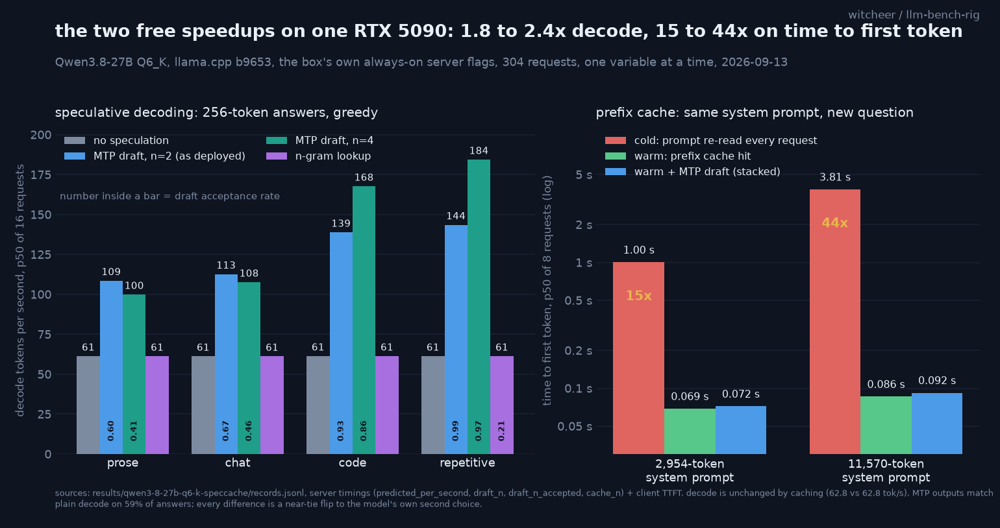

# Speculative decoding and prefix caching on one RTX 5090, Qwen3.8-27B Q6_K: the two free speedups on the model this box now serves

**TL;DR.** Rerun of the [spec-cache study](spec-cache-study.md) on Qwen3.8-27B Q6_K (unsloth GGUF with its own embedded MTP drafter), the model this box moved to on 2026-09-13, same flag set as the always-on server: llama.cpp b9653, one RTX 5090, ctx 65536, `--parallel 1`, flash attention on, KV q8_0/q8_0, batch size 1. Speculative decoding with the MTP head at n=2 lifts decode from 61 tok/s to **109 to 144 tok/s** by workload (1.8x prose, 1.8x chat, 2.3x code, 2.3x repetitive), for +9 ms on time to first token. n=4 reaches 168 to 184 tok/s on code and repetitive text and **loses** to n=2 on prose and chat by 5 to 8%; n-gram lookup does nothing on 256-token answers. Prefix caching cuts time to first token on a re-used 2,954-token system prompt from **1.004 s to 0.069 s** (15x) and on an 11,570-token one from **3.814 s to 0.086 s** (44x), decode untouched. Stacked, a short answer to the 11.5k context goes from 4.25 s to 0.30 s end to end. Losslessness: MTP output is byte-identical to plain greedy decode on 59% of answers; every one of the 13 divergences examined is a flip to the target model's own second choice at a near-tie (top-1 vs top-2 gap 0.004 to 0.133 nats, median 0.030), never a token the target had not itself ranked top-2. The Qwen3.6-27B numbers from the first run are within a few tok/s and a few ms everywhere; the two speedups are a property of the shape and the serving stack, not of the generation.

## Why a rerun

The first study (2026-09-06) ran on Qwen3.6-27B Q6_K because that was the model the box served. The box moved to Qwen3.8-27B Q6_K on 2026-09-13 (same 27B dense shape, same quant, the newer generation, and a shipped MTP head in the same GGUF). The claim of the study is "what the two techniques buy on the model you actually run", so it is remeasured on the model actually run. Same script, same 32 prompts, same 304-request design, one variable changed: the model file.

## Setup

- **Hardware:** RTX 5090 32GB (sm_120), single card, single stream, batch size 1.
- **Model and server:** `Qwen3.8-27B-Q6_K.gguf` (unsloth, `qwen35.nextn_predict_layers = 1`, four `blk.64.nextn.*` tensors), llama.cpp b9653, `-ngl 99`, ctx 65536, `--parallel 1`, flash attention on, KV cache q8_0/q8_0. VRAM 24.1 GB base, 24.8 GB with the MTP head at n=2, 25.1 GB at n=4. The resident server was drained and a bench instance started on a separate port with the identical line; restored after.
- **Client, legs, cell sizes:** identical to the first study (`lib/speed_served.py` lineage; spec leg 4 workloads x 8 prompts x 2 repeats x 4 modes = 256 records; cache leg 32; stacked 16; 304 total, one 17-minute run 2026-09-13 07:49 to 08:05 UTC). Raw file: `results/qwen3-8-27b-q6-k-speccache/records.jsonl`. Losslessness leg: 64 non-streaming records with `top_logprobs: 2`, `results/qwen3-8-27b-q6-k-speccache/lossless.jsonl`.

## Leg A: speculative decoding

Decode tok/s, p50 (p90 within 0.3 tok/s of p50 for every base cell):

| workload | none | MTP n=2 | MTP n=4 | n-gram |
|---|---:|---:|---:|---:|
| prose | 61.3 | **108.6** (1.77x, acc 0.62) | 100.0 (1.63x, acc 0.40) | 61.3 (1.00x) |
| chat | 61.3 | **112.7** (1.84x, acc 0.67) | 107.7 (1.76x, acc 0.46) | 61.2 (1.00x) |
| code | 61.4 | 138.9 (2.26x, acc 0.93) | **167.7** (2.73x, acc 0.87) | 61.3 (1.00x) |
| repetitive | 61.3 | 143.5 (2.34x, acc 0.99) | **184.4** (3.01x, acc 0.97) | 61.3 (1.00x) |

`acc` is the draft acceptance rate, `draft_n_accepted / draft_n` summed over the cell.

TTFT: none 0.134 to 0.138 s, MTP 0.142 to 0.146 s (about +9 ms), n-gram 0.132 to 0.137 s.

Reads, unchanged from the first study:

1. **n=2 is the general-purpose setting.** 1.8 to 2.3x on every workload.
2. **Depth only pays above roughly 0.85 acceptance.** n=4 beats n=2 by 21% on code and 29% on repetitive text, and loses by 8% on prose and 5% on chat. The prose/chat penalty is a little larger on 3.8 than on 3.6 (3 to 4% there), because 3.8's n=4 acceptance on open text is lower (0.40 / 0.46 vs 0.44 / 0.51).
3. **n-gram lookup is a no-op on short answers.** It engaged on repetitive text (acceptance 0.21) and code (0.05) and never moved the speed.
4. **Greedy base decode is deterministic on this build:** rep0 and rep1 byte-identical on 32/32 prompts, for base and for MTP n=2 alike.

### Losslessness: same quality class, not byte-identical

MTP n=2 output matched plain greedy decode on 38/64 spec-leg answers (59%); n=4 on 42/64; n-gram on 64/64. By workload for n=2: code 16/16 identical, repetitive 14/16, chat 6/16, prose 2/16. The pattern is the one seen on 3.6: open text diverges, code does not.

The logprobs leg (32 prompt pairs, base vs MTP n=2, one pass each):

- identical 19/32 (prose 1/8, chat 3/8, repetitive 7/8, code 8/8);
- at the first differing token of the 13 divergent pairs, the base model's top-1 vs top-2 gap is **0.004 to 0.133 nats, median 0.030**. Across all 7,649 base tokens, 0.8% have a gap under 0.05 and 3.4% under 0.2;
- **in 13 of 13 cases the MTP path emitted the base model's own second choice** (`' transferring'` vs `' printing'` at 0.029; `' spiral'` vs `','` at 0.004; `' worked'` vs `' and'` at 0.133, the widest);
- output length unchanged in 13/13; 11 of 13 pairs are identical for at least their first 120 characters.

Same sentence as before, now on the served model: **the words change in 41% of open-ended outputs, the model choosing them does not.**

## Leg B: prefix caching

TTFT p50 / p90, same system prompt, a new question each request:

| system prompt | cold | warm | speedup | server prompt_n cold -> warm |
|---|---:|---:|---:|---|
| 2,954 tokens | 1.004 / 1.007 s | **0.069 / 0.069 s** | 15x | 2,954 -> 21 |
| 11,570 tokens | 3.814 / 3.821 s | **0.086 / 0.086 s** | 44x | 11,570 -> 21 |

Decode is unchanged by caching (62.8 vs 62.8 tok/s at 4k, 61.1 vs 61.3 at 16k). Cold prefill rate: 2,942 to 3,034 tok/s.

## Leg C: stacked

Warm cache plus MTP n=2, short answer to the long shared context:

| system prompt | base cold, total per answer | stacked, TTFT | stacked, decode | stacked, total | end-to-end |
|---|---:|---:|---:|---:|---:|
| 2,954 tokens | 1.48 s | 0.072 s | 137.0 tok/s | 0.29 s | 5.1x |
| 11,570 tokens | 4.25 s | 0.092 s | 134.6 tok/s | 0.30 s | 14x |

Stacked acceptance 0.88 (4k) and 0.95 (16k): the handbook answers are short and formulaic, so the decode sits in the code-like regime.

## 3.6 vs 3.8, side by side

| cell | Qwen3.6-27B Q6_K (09-06) | Qwen3.8-27B Q6_K (09-13) |
|---|---:|---:|
| base decode, all workloads | 61.2 to 61.4 | 61.3 to 61.4 |
| MTP n=2 prose / chat / code / rep | 112 / 118 / 140 / 144 | 109 / 113 / 139 / 144 |
| MTP n=4 prose / chat / code / rep | 107 / 114 / 169 / 183 | 100 / 108 / 168 / 184 |
| warm TTFT 4k / 16k | 0.067 / 0.084 s | 0.069 / 0.086 s |
| cold TTFT 4k / 16k | 1.005 / 3.835 s | 1.004 / 3.814 s |
| MTP identical to base (spec leg) | 36/64 | 38/64 |
| flips = base's 2nd choice | 14/14 | 13/13 |

Everything is within run-to-run noise except the n=2 open-text cells, where 3.8 is 3 to 5 tok/s slower because its drafter is accepted slightly less often on prose and chat (0.62 / 0.67 vs 0.65 / 0.71). The generation change is a quality story (see the board), not a speed one.

## Honest limits

As in the first study: one model, one quant, one build, batch size 1, 256-token answers, the vendor's shipped drafter, 32 prompt pairs for the losslessness check. TTFT is localhost wall clock.
