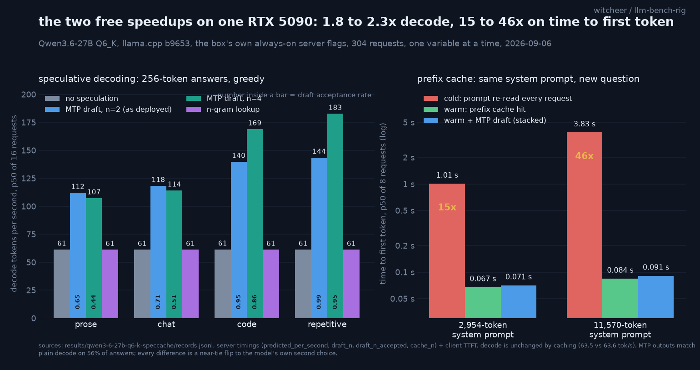

# Speculative decoding and prefix caching on one RTX 5090: what the two free speedups buy on a model you actually run

**TL;DR.** The two single-GPU optimisations every inference text names first, speculative decoding and prompt (prefix) caching, measured on the exact model and flag set this box serves every day: Qwen3.6-27B Q6_K with its embedded MTP drafter, llama.cpp b9653, one RTX 5090, batch size 1. Speculative decoding with the MTP head at n=2 (the deployed setting) lifts decode from 61 tok/s to **112 to 144 tok/s** depending on how predictable the text is (1.8x prose, 1.9x chat, 2.3x code, 2.3x repetitive), for +10 ms on time to first token. n=4 goes to 169 to 183 tok/s on code and repetitive text and **loses** to n=2 on prose and chat; n-gram lookup does nothing on 256-token answers. Prefix caching cuts time to first token on a re-used 2,954-token system prompt from **1.005 s to 0.067 s** (15x) and on an 11,570-token one from **3.835 s to 0.084 s** (46x), and leaves decode speed untouched. Stacked, a short answer to a long shared context goes from 4.18 s to 0.24 s end to end. On losslessness: MTP output is byte-identical to plain greedy decode on 56% of answers; every one of the 14 divergences examined is a flip to the target model's own second choice at a near-tie (top-1 vs top-2 gap under 0.09 nats), never a token the target had not itself ranked top-2.

## Why this study

Inference engineering references (this one was prompted by Kiely, *Inference Engineering*, 2026, ch 5.2 and 5.3) name speculative decoding and prefix caching as the highest-leverage single-GPU techniques, and give no local numbers. Vendor and framework pages quote multipliers measured on datacentre cards, batched, on their own prompts. The question here is narrower and more useful to anyone running a 27B on a consumer card: on **this** box, on the model it actually serves, with the flags it actually runs, what do the two techniques buy, one at a time and then together?

## Setup

- **Hardware:** RTX 5090 32GB (sm_120), single card, single stream, batch size 1.
- **Model and server:** `Qwen3.6-27B-MTP-Q6_K.gguf` (unsloth, embedded MTP drafter head), llama.cpp b9653, `-ngl 99`, ctx 65536, `--parallel 1`, flash attention on, KV cache q8_0/q8_0. These are the always-on server's own flags, copied, not re-typed. The resident server was drained and a bench instance started on a separate port with the identical line; restored after.
- **Client:** streaming chat completions with `stream_options.include_usage`, recording per request the client-side TTFT (first content chunk), total wall time, and the server's `timings` object (`predicted_per_second`, `prompt_n`, `cache_n`, `draft_n`, `draft_n_accepted`). Decode tok/s below is the server's own `predicted_per_second`; TTFT is client wall clock. One warm-up request per server start discarded. The client is now `lib/speed_served.py` in this repo.
- **Spec leg (A):** four workloads, prose / chat / code / repetitive, 8 prompts each, 2 repeats, 256 completion tokens, temperature 0, seed 42, thinking off. Modes: `--spec-type none`, `draft-mtp` with `n_max 2`, `draft-mtp n_max 4`, `ngram-simple`. 256 records.
- **Cache leg (B):** a shared system prompt of 2,954 or 11,570 real tokens (server `prompt_n`), 8 distinct questions, `cache_prompt: false` (cold: the server re-reads the prompt every request) vs `cache_prompt: true` after one priming request (warm). 32 records. **Stacked (C):** warm cache plus `draft-mtp n_max 2`, 16 records.
- Everything is p50 over the cell (16 requests for spec cells, 8 for cache cells); p90 is reported where it differs. 304 records, one script, one 17-minute run, 2026-09-06. Raw file: `results/qwen3-6-27b-q6-k-speccache/records.jsonl`.

## Leg A: speculative decoding

Decode tok/s, p50 (p90 within 0.6 tok/s of p50 for every base cell):

| workload | none | MTP n=2 | MTP n=4 | n-gram |
|---|---:|---:|---:|---:|
| prose | 61.3 | **112.1** (1.83x, acc 0.65) | 107.3 (1.75x, acc 0.44) | 61.2 (1.00x) |
| chat | 61.2 | **118.2** (1.93x, acc 0.71) | 114.1 (1.86x, acc 0.51) | 61.2 (1.00x) |
| code | 61.4 | 139.8 (2.28x, acc 0.95) | **168.9** (2.75x, acc 0.86) | 61.2 (1.00x) |
| repetitive | 61.3 | 143.5 (2.34x, acc 0.99) | **182.8** (2.98x, acc 0.95) | 61.2 (1.00x) |

`acc` is the draft acceptance rate, `draft_n_accepted / draft_n` summed over the cell.

TTFT: none 0.135 s, MTP 0.143 to 0.148 s (the drafter's own forward pass, about +10 ms), n-gram 0.131 to 0.135 s.

Reads:

1. **The deployed setting (n=2) is the right general-purpose one.** 1.8 to 2.3x across every workload, and never worse than n=4 by more than 4% on the workloads where n=4 wins.
2. **Draft depth only pays when acceptance stays high.** n=4 beats n=2 by 21 to 27% on code and repetitive text (acceptance 0.86 to 0.95) and loses by 3 to 4% on prose and chat (acceptance 0.44 to 0.51). Each rejected draft token is a wasted verification slot; below roughly 0.85 acceptance the extra depth costs more than it returns. If the box mostly writes code, n=4; if it mostly talks, n=2.
3. **n-gram lookup is a no-op on short answers.** It engaged (acceptance 5 to 10% on the two workloads where it fired at all) and found nothing worth accepting inside 256 tokens. It is designed for long outputs that repeat their own input; this is not that regime.
4. **Greedy base decode is deterministic on this build.** rep0 and rep1 were byte-identical on 32/32 prompts, which is what makes the losslessness check below meaningful.

### Losslessness: same quality class, not byte-identical

Speculative decoding is normally described as lossless: the target model verifies every drafted token against its own logits, so the output distribution is the target's. On this build the n-gram mode was byte-identical to plain decode on 64/64 outputs. MTP was **not**: 36/64 identical (n=2), 38/64 (n=4); the differences concentrate in prose (14/16 differ) and chat (10/16), with only 4/16 in code.

A follow-up leg (2026-09-07, 64 records, non-streaming with `logprobs` and `top_logprobs: 2`) located the first divergent token in each of the 14 differing pairs (18/32 identical, the same 56% rate) and read the base model's own logit gap there:

- at the first differing token, the base model's top-1 vs top-2 gap is **0.004 to 0.086 nats, median 0.028**. Across all 7,656 base tokens, only 0.6% have a gap under 0.05 and 2.1% under 0.2, so every divergence sits inside that thin near-tie band;
- **in 14 of 14 cases the MTP path emitted the base model's own second choice** (`' France'` vs `' Russia'` at a gap of 0.022; `' a'` vs `' the'` at 0.004). The drafter never introduced a token the target had not itself ranked top-2;
- output length was unchanged in 13/14 (one code answer 253 vs 251 tokens).

The likely mechanism is the batched verification pass producing slightly different logits from single-token decode (numerical, accumulation order in the batched kernels; the same class of effect seen in this repo's cacheback work, where 8 of 46,080 tokens flipped at bf16 ties), which flips argmaxes exactly where the target was nearly indifferent. That is inferred from where the flips land, not proven by inspecting the kernels. So the honest sentence is: **the words change in 44% of open-ended outputs, the model choosing them does not.** For anything scored on correctness this is invisible (the same model, the same top-2, picked at a coin-flip margin); for byte-exact reproducibility across spec on/off, it is not lossless and should not be called that. Speed numbers from the logprobs leg are not comparable to the table above (top-2 extraction on a 150k vocabulary halves decode) and are not reported.

## Leg B: prefix caching

TTFT p50 / p90, same system prompt, a new question each request:

| system prompt | cold | warm | speedup | server prompt_n cold -> warm |
|---|---:|---:|---:|---|
| 2,954 tokens | 1.005 / 1.008 s | **0.067 / 0.068 s** | 15x | 2,954 -> 21 |
| 11,570 tokens | 3.835 / 3.843 s | **0.084 / 0.085 s** | 46x | 11,570 -> 21 |

Decode speed is unchanged by caching (63.5 vs 63.6 tok/s at 4k, 61.5 vs 61.7 at 16k): the cache buys prefill only, as it should. The cold numbers give the card's prefill rate on this model, 2,940 to 3,017 tok/s, which matches the ~2,880 tok/s the always-on server logs on its real 16.9k-token daily prompt.

Two practical notes. `cache_prompt` is a per-request field in llama-server's API and defaults to on, so most clients get this for free; the cold rows were produced by turning it off. And the cache is keyed on the exact token prefix: a system prompt that embeds the date or a request id at the top invalidates it every time.

## Leg C: stacked

Warm cache plus MTP n=2, short answer to the long shared context:

| system prompt | base cold, total per answer | stacked, TTFT | stacked, decode | stacked, total | end-to-end |
|---|---:|---:|---:|---:|---:|
| 2,954 tokens | 1.33 s | 0.071 s | 133.1 tok/s | 0.21 s | 6.3x |
| 11,570 tokens | 4.18 s | 0.091 s | 133.9 tok/s | 0.24 s | 17x |

No interference: the stacked decode (133 to 134 tok/s) is above the spec-only prose/chat cells because the handbook answers are short and formulaic, closer to the code/repetitive acceptance regime (0.92 to 0.96 here). The batching-vs-speculation conflict that references warn about does not exist at batch size 1, which is where a single-user box lives.

## What it means for a box like this one

This server's one daily job is a 16.9k-token prompt followed by about 450 output tokens and a 2k follow-up. That is exactly the stacked regime: about 4 s of prefill once, then ~0.1 s TTFT and 110 to 140 tok/s for everything after. The deployed configuration (MTP n=2, cache on) is close to optimal for it; n=4 would gain on code-shaped output and lose on prose. Two things any single-user llama.cpp setup should check: that the model's drafter head is actually engaged (the all-1.00x row is the tell that it is not), and that the system prompt is stable token-for-token so the cache can hit.

## Honest limits

- One model, one quant, one build, batch size 1. The multipliers are for this regime; batched serving changes both techniques' economics.
- 256-token answers for the spec leg. Longer outputs would favour n-gram lookup on repetitive text and would let acceptance drift; the depth question is not studied here.
- The MTP head is the vendor's shipped drafter for this model. Other drafter types (EAGLE-style, separate small-model drafts) and other models will have different acceptance curves.
- Losslessness was examined on 32 prompt pairs with top-2 logprobs; the "always the second choice" finding is 14/14, which is strong but small.
- TTFT is client wall clock over localhost; add your network.
